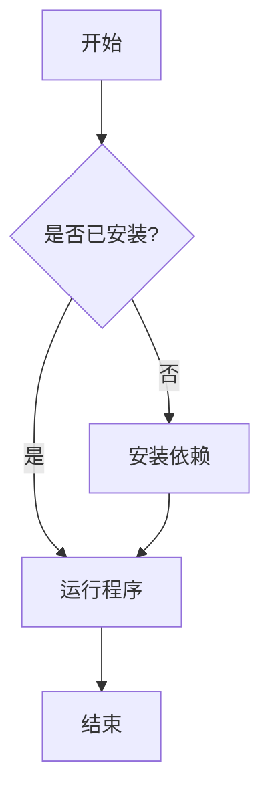
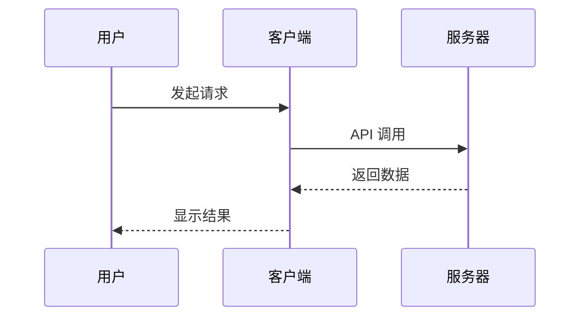
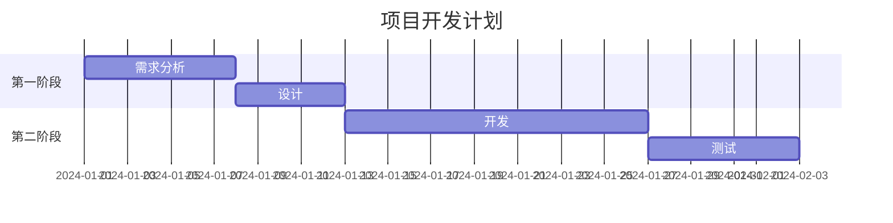
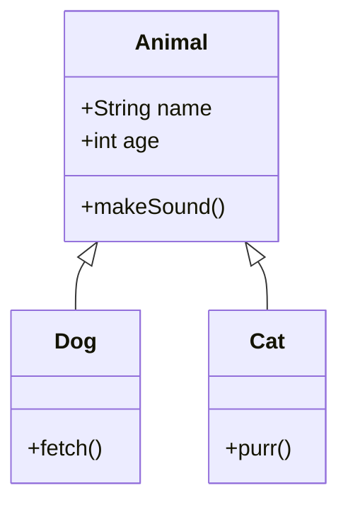

# 第十五章：README 与项目文档编写指南

> 好的文档是项目成功的一半。本章将全面介绍如何在 GitHub 上编写专业的 README 和项目文档。

---

## 目录

- [15.1 README 的重要性](#151-readme-的重要性)
- [15.2 README 基本结构](#152-readme-基本结构)
- [15.3 Markdown 语法详解](#153-markdown-语法详解)
- [15.4 高级 Markdown 技巧](#154-高级-markdown-技巧)
- [15.5 徽章（Badge）使用指南](#155-徽章badge使用指南)
- [15.6 项目文档结构设计](#156-项目文档结构设计)
- [15.7 API 文档生成](#157-api-文档生成)
- [15.8 贡献指南编写](#158-贡献指南contributingmd编写)
- [15.9 变更日志规范](#159-变更日志changelogmd规范)
- [15.10 许可证选择指南](#1510-许可证license选择指南)
- [15.11 行为准则](#1511-行为准则code_of_conductmd)
- [15.12 双语 README 最佳实践](#1512-双语-readme-最佳实践)
- [15.13 README 模板与范例](#1513-readme-模板与范例)
- [15.14 文档自动化工具](#1514-文档自动化工具)
- [15.15 中文项目文档写作规范](#1515-中文项目文档写作规范)

---

## 15.1 README 的重要性

### 15.1.1 第一印象决定一切

在 GitHub 上，README 文件是访客看到的第一个内容。研究表明，用户在访问一个新项目时，平均只会花 **7 秒钟** 决定是否继续了解这个项目。这意味着你的 README 必须在这短短几秒内抓住读者的注意力。

一个优秀的 README 能够：

- **吸引贡献者**：清晰的项目描述和贡献指南会让更多开发者愿意参与
- **降低使用门槛**：详细的安装和使用说明让用户快速上手
- **建立专业形象**：规范的文档体现项目的成熟度和维护者的专业态度
- **提升 SEO 效果**：GitHub 搜索引擎会索引 README 内容，好的文档能增加项目曝光率
- **减少重复问题**：完善的文档可以解答大部分常见问题，减轻维护者负担

### 15.1.2 项目门面的作用

把 README 想象成你项目的"门面"。就像一家商店的橱窗展示一样，README 需要：

1. **清晰传达价值**：用户应该在几秒内理解这个项目能做什么
2. **展示项目状态**：通过徽章展示构建状态、版本号、测试覆盖率等
3. **提供快速入口**：让用户能够快速安装和体验项目
4. **建立信任感**：展示活跃的社区、及时的维护和专业的态度

### 15.1.3 反面案例分析

以下是一个糟糕 README 的典型特征：

```markdown
# My Project

This is my project.

Usage: see code.
```

**问题分析：**
- 没有项目描述，用户不知道这是什么
- 没有安装说明，用户无法使用
- 没有示例代码，用户不知道如何开始
- 没有许可证，用户不知道是否可以使用

---

## 15.2 README 基本结构

### 15.2.1 标准结构概览

一个完整的 README 通常包含以下部分：

```markdown
# 项目名称

> 一句话简短描述

[徽章区域]

## 📖 简介

详细的项目介绍...

## ✨ 特性

- 特性一
- 特性二

## 🚀 快速开始

### 安装

### 使用

## 📚 文档

## 🤝 贡献

## 📄 许可证

## 🙏 致谢
```

### 15.2.2 各部分详细说明

**标题（项目名称）**

标题应该简洁明了，使用一级标题（`#`）。如果项目有品牌名称，可以加上 Logo：

```markdown
<div align="center">
  
  <h1>ProjectName</h1>
  <p>简洁有力的项目描述</p>
</div>
```

**项目描述**

描述应该回答以下问题：
- 这个项目是什么？
- 解决什么问题？
- 有什么独特之处？

```markdown
## 📖 简介

ProjectName 是一个用 Python 编写的高性能数据处理框架。它能够帮助开发者
快速处理大规模数据集，支持并行计算和分布式处理。

**为什么选择 ProjectName？**
- 🚀 比传统方案快 10 倍
- 🎯 简洁的 API 设计
- 🔌 丰富的插件生态
```

**安装说明**

提供多种安装方式，覆盖不同用户需求：

```markdown
## 🚀 安装

### 使用 pip 安装（推荐）

```bash
pip install projectname
```

### 从源码安装

```bash
git clone https://github.com/username/projectname.git
cd projectname
pip install -e .
```

### 使用 Docker

```bash
docker pull username/projectname:latest
docker run -p 8080:8080 username/projectname
```

**使用示例**

提供清晰的代码示例，让用户快速上手：

```markdown
## 💻 使用示例

### 基础用法

```python
from projectname import Processor

# 创建处理器实例
processor = Processor()

# 处理数据
result = processor.process(data)
print(result)
```

### 高级用法

```python
# 配置并行处理
processor = Processor(workers=4, batch_size=1000)
result = processor.process(large_dataset)
```
```

**贡献指南**

简要说明如何参与贡献：

```markdown
## 🤝 贡献

欢迎贡献！请阅读 [贡献指南](CONTRIBUTING.md) 了解详情。

1. Fork 本仓库
2. 创建你的特性分支 (`git checkout -b feature/AmazingFeature`)
3. 提交你的改动 (`git commit -m 'Add some AmazingFeature'`)
4. 推送到分支 (`git push origin feature/AmazingFeature`)
5. 打开一个 Pull Request
```

---

## 15.3 Markdown 语法详解

### 15.3.1 标题

Markdown 支持六级标题，使用 `#` 号表示：

```markdown
# 一级标题
## 二级标题
### 三级标题
#### 四级标题
##### 五级标题
###### 六级标题
```

**最佳实践：**
- 每个 README 只使用一个一级标题（项目名称）
- 标题层级不要跳级（如从 `##` 直接到 `####`）
- 标题前后保留空行

### 15.3.2 列表

**无序列表：**

```markdown
- 第一项
- 第二项
  - 子项 A
  - 子项 B
- 第三项
```

**有序列表：**

```markdown
1. 第一步
2. 第二步
3. 第三步
```

**嵌套列表：**

```markdown
1. 主要步骤
   - 子步骤 1
   - 子步骤 2
2. 次要步骤
   - 子步骤 A
     - 详细说明
```

### 15.3.3 链接

**行内链接：**

```markdown
[链接文字](https://example.com)
[带标题的链接](https://example.com "鼠标悬停显示的文字")
```

**引用链接：**

```markdown
[链接文字][引用标签]

[引用标签]: https://example.com "可选标题"
```

**锚点链接（页内跳转）：**

```markdown
[跳转到安装章节](#安装说明)
```

注意：锚点链接需要将标题中的空格替换为连字符，并转换为小写。

### 15.3.4 图片

**基本图片：**

```markdown

```

**带链接的图片：**

markdown
[](链接地址)

**指定图片大小（HTML 方式）：**

```html

```

**居中显示图片：**

```html
<div align="center">
  
</div>
```

### 15.3.5 代码块

**行内代码：**

```markdown
使用 `print()` 函数输出内容
```

**代码块（带语法高亮）：**

````markdown
```python
def hello():
    print("Hello, World!")
```
````

**常用语言标识：**

| 语言     | 标识          |
| -------- | ------------- |
| Python   | `python`      |
| JavaScript | `javascript` 或 `js` |
| Java     | `java`        |
| C++      | `cpp`         |
| Bash     | `bash` 或 `sh` |
| JSON     | `json`        |
| Markdown | `markdown`    |
| YAML     | `yaml`        |

**Diff 格式（展示代码变更）：**

````markdown
```diff
- 旧代码
+ 新代码
```
````

### 15.3.6 表格

**基本表格：**

```markdown
| 列1 | 列2 | 列3 |
|-----|-----|-----|
| 内容1 | 内容2 | 内容3 |
| 内容4 | 内容5 | 内容6 |
```

**对齐方式：**

```markdown
| 左对齐 | 居中对齐 | 右对齐 |
|:-------|:--------:|-------:|
| 内容   |   内容   |   内容 |
```

**实际示例：**

```markdown
| 浏览器 | 版本要求 | 支持状态 |
|:-------|:--------:|:--------:|
| Chrome | >= 80    | ✅ 完全支持 |
| Firefox| >= 78    | ✅ 完全支持 |
| Safari | >= 14    | ⚠️ 部分支持 |
| IE     | 11       | ❌ 不支持 |
```

### 15.3.7 引用

**基本引用：**

```markdown
> 这是一段引用文字
```

**多层引用：**

```markdown
> 第一层引用
>> 第二层引用
>>> 第三层引用
```

**引用中使用其他 Markdown：**

```markdown
> **注意：** 这是一个重要的提示。
>
> - 要点一
> - 要点二
```

---

## 15.4 高级 Markdown 技巧

### 15.4.1 折叠块（Details/Summary）

GitHub 支持使用 HTML 的 `<details>` 标签创建可折叠的内容块，这在展示长代码、详细说明或可选内容时非常有用：

```markdown
<details>
<summary>点击展开详细说明</summary>

这里是隐藏的内容，可以包含任何 Markdown 格式：

- 列表项
- 代码块
- 表格

```python
def example():
    return "Hello"
```

</details>
```

**实际应用场景：**

```markdown
<details>
<summary>📦 安装步骤（点击展开）</summary>

### Windows

```bash
# 下载安装包
curl -O https://example.com/install.ps1
# 运行安装
powershell -ExecutionPolicy Bypass -File install.ps1
```

### macOS

```bash
brew install projectname
```

### Linux

```bash
sudo apt-get install projectname
```

</details>
```

### 15.4.2 任务列表

任务列表可以用来展示项目进度、待办事项等：

```markdown
## 开发进度

- [x] 完成基础功能
- [x] 添加单元测试
- [ ] 实现高级特性
- [ ] 编写文档
- [ ] 性能优化
```

**渲染效果：**

- [x] 完成基础功能
- [x] 添加单元测试
- [ ] 实现高级特性
- [ ] 编写文档
- [ ] 性能优化

### 15.4.3 数学公式

GitHub 原生支持 LaTeX 数学公式渲染：

**行内公式：**

```markdown
质能方程 $E = mc^2$ 是物理学中最著名的公式之一。
```

**块级公式：**

```markdown
$$
\sum_{i=1}^{n} i = \frac{n(n+1)}{2}
$$

$$
\int_{0}^{\infty} e^{-x^2} dx = \frac{\sqrt{\pi}}{2}
$$
```

**矩阵：**

```markdown
$$
\begin{pmatrix}
a & b \\
c & d
\end{pmatrix}
$$
```

### 15.4.4 Mermaid 图表

GitHub 支持 Mermaid 语法绘制流程图、时序图等：

**流程图：**

````markdown

````

**时序图：**

````markdown

````

**甘特图：**

````markdown

````

**类图：**

````markdown

````

### 15.4.5 警告提示框（Alerts）

GitHub 支持特殊的警告提示框语法：

```markdown
> [!NOTE]
> 这是一个注释提示框

> [!TIP]
> 这是一个提示框

> [!IMPORTANT]
> 这是一个重要信息框

> [!WARNING]
> 这是一个警告框

> [!CAUTION]
> 这是一个注意框
```

---

## 15.5 徽章（Badge）使用指南

### 15.5.1 什么是徽章

徽章（Badge）是 README 顶部的小图标，用于快速展示项目的关键信息。它们通常来自 [shields.io](https://shields.io/)，可以动态显示构建状态、版本号、下载量等信息。

### 15.5.2 shields.io 使用方法

**基本语法：**

```markdown

```

**自定义徽章：**

```markdown

```

**常用颜色：**

| 颜色   | 十六进制码 | 适用场景     |
| ------ | ---------- | ------------ |
| 绿色   | `brightgreen` | 成功、通过 |
| 红色   | `red`      | 失败、错误   |
| 蓝色   | `blue`     | 信息、版本   |
| 黄色   | `yellow`   | 警告、测试中 |
| 橙色   | `orange`   | 临界状态     |
| 灰色   | `lightgrey` | 不活跃      |

### 15.5.3 常用徽章示例

**CI/CD 状态徽章：**

```markdown
<!-- GitHub Actions -->


<!-- Travis CI -->


<!-- Jenkins -->

```

**版本号徽章：**

```markdown
<!-- npm 版本 -->


<!-- Python PyPI 版本 -->


<!-- GitHub Release -->


<!-- Maven -->

```

**下载量徽章：**

```markdown
<!-- npm 下载量 -->


<!-- PyPI 下载量 -->


<!-- GitHub 下载量 -->

```

**代码质量徽章：**

```markdown
<!-- 代码覆盖率 -->


<!-- Code Climate -->


<!-- SonarQube -->

```

**许可证徽章：**

```markdown


```

**其他实用徽章：**

```markdown
<!-- GitHub Stars -->


<!-- GitHub Forks -->


<!-- GitHub Issues -->


<!-- PRs Welcome -->


<!-- 维护状态 -->


<!-- Python 版本 -->


<!-- 平台支持 -->

```

### 15.5.4 徽章最佳实践

```markdown
# Project Name

[](https://github.com/user/repo/actions)
[](https://www.npmjs.com/package/package)
[](LICENSE)
[](https://npmjs.com/package/package)

> 项目描述
```

**注意事项：**
- 徽章应该有链接，点击后跳转到相关页面
- 不要放太多徽章，5-8 个为宜
- 将最重要的徽章放在前面
- 确保徽章与项目相关

---

## 15.6 项目文档结构设计

### 15.6.1 docs/ 目录结构

对于较大的项目，建议使用 `docs/` 目录存放详细文档：

```
project/
├── README.md              # 项目首页
├── docs/
│   ├── getting-started.md # 快速开始
│   ├── installation.md    # 安装指南
│   ├── configuration.md   # 配置说明
│   ├── api-reference.md   # API 参考
│   ├── examples/          # 示例目录
│   │   ├── basic.md
│   │   └── advanced.md
│   ├── guides/            # 指南目录
│   │   ├── contributing.md
│   │   └── deployment.md
│   ├── faq.md             # 常见问题
│   └── changelog.md       # 变更日志
├── CONTRIBUTING.md        # 贡献指南
├── LICENSE                # 许可证
└── CODE_OF_CONDUCT.md     # 行为准则
```

### 15.6.2 Wiki 使用

GitHub Wiki 是另一个存放文档的好地方，适合：

- 社区驱动的文档
- 需要多人协作编辑的内容
- 不需要版本控制的文档

**Wiki 的优点：**
- 独立的 Git 仓库
- 支持侧边栏导航
- 可以设置编辑权限

**Wiki 的缺点：**
- 不在主仓库中，可能被忽视
- PR 机制不同
- SEO 效果较差

### 15.6.3 GitHub Pages

GitHub Pages 可以将文档部署为静态网站：

**使用 GitHub Pages 的步骤：**

1. 创建 `gh-pages` 分支或在 `docs/` 目录中放置静态文件
2. 在仓库设置中启用 GitHub Pages
3. 选择部署源（分支和目录）

**常用文档生成工具：**

| 工具          | 语言     | 特点                   |
| ------------- | -------- | ---------------------- |
| Jekyll        | Ruby     | GitHub 原生支持        |
| MkDocs        | Python   | 简单易用，主题丰富     |
| Docusaurus    | React    | Facebook 出品，功能强大|
| VuePress      | Vue      | Vue 驱动，适合 Vue 项目|
| Sphinx        | Python   | API 文档生成强大       |
| Docsify       | JavaScript | 无需构建，开箱即用   |

**MkDocs 配置示例：**

```yaml
# mkdocs.yml
site_name: 项目文档
theme:
  name: material
  language: zh
  palette:
    primary: indigo
    accent: indigo
nav:
  - 首页: index.md
  - 快速开始: getting-started.md
  - API 文档: api.md
  - 贡献指南: contributing.md
markdown_extensions:
  - admonition
  - codehilite
  - toc:
      permalink: true
```

---

## 15.7 API 文档生成

### 15.7.1 JSDoc（JavaScript）

JSDoc 是 JavaScript 最流行的文档注释标准：

```javascript
/**
 * 计算两个数的和
 * @param {number} a - 第一个数字
 * @param {number} b - 第二个数字
 * @returns {number} 两数之和
 * @example
 * // 返回 5
 * add(2, 3);
 * @throws {TypeError} 参数必须是数字
 */
function add(a, b) {
  if (typeof a !== 'number' || typeof b !== 'number') {
    throw new TypeError('参数必须是数字');
  }
  return a + b;
}

/**
 * 用户类
 * @class
 * @property {string} name - 用户名
 * @property {number} age - 年龄
 */
class User {
  /**
   * 创建用户实例
   * @param {string} name - 用户名
   * @param {number} age - 年龄
   */
  constructor(name, age) {
    this.name = name;
    this.age = age;
  }

  /**
   * 获取用户信息
   * @returns {Object} 用户信息对象
   */
  getInfo() {
    return { name: this.name, age: this.age };
  }
}
```

**常用 JSDoc 标签：**

| 标签         | 说明             |
| ------------ | ---------------- |
| `@param`     | 函数参数         |
| `@returns`   | 返回值           |
| `@throws`    | 抛出的异常       |
| `@example`   | 使用示例         |
| `@deprecated` | 已弃用          |
| `@see`       | 相关链接         |
| `@typedef`   | 类型定义         |
| `@callback`  | 回调函数类型     |

### 15.7.2 Swagger/OpenAPI（REST API）

Swagger 是 REST API 文档的事实标准：

**OpenAPI 3.0 示例：**

```yaml
openapi: 3.0.0
info:
  title: 用户管理 API
  description: 用户管理系统的 RESTful API 文档
  version: 1.0.0
  contact:
    name: API 支持
    email: support@example.com
servers:
  - url: https://api.example.com/v1
    description: 生产环境
  - url: https://staging-api.example.com/v1
    description: 测试环境
paths:
  /users:
    get:
      summary: 获取用户列表
      description: 返回所有用户的列表
      tags:
        - 用户
      parameters:
        - name: page
          in: query
          description: 页码
          schema:
            type: integer
            default: 1
        - name: limit
          in: query
          description: 每页数量
          schema:
            type: integer
            default: 20
      responses:
        '200':
          description: 成功
          content:
            application/json:
              schema:
                type: object
                properties:
                  users:
                    type: array
                    items:
                      $ref: '#/components/schemas/User'
                  total:
                    type: integer
        '401':
          description: 未授权
    post:
      summary: 创建用户
      description: 创建一个新用户
      tags:
        - 用户
      requestBody:
        required: true
        content:
          application/json:
            schema:
              $ref: '#/components/schemas/CreateUser'
      responses:
        '201':
          description: 创建成功
        '400':
          description: 请求参数错误
components:
  schemas:
    User:
      type: object
      properties:
        id:
          type: integer
          description: 用户 ID
        name:
          type: string
          description: 用户名
        email:
          type: string
          format: email
          description: 邮箱
    CreateUser:
      type: object
      required:
        - name
        - email
      properties:
        name:
          type: string
        email:
          type: string
          format: email
```

**Swagger UI 预览：**

可以使用 [Swagger Editor](https://editor.swagger.io/) 在线编辑和预览 API 文档。

### 15.7.3 Sphinx（Python）

Sphinx 是 Python 项目的标准文档生成工具：

**安装和配置：**

```bash
pip install sphinx sphinx-rtd-theme
sphinx-quickstart docs
```

**conf.py 配置示例：**

```python
project = '项目名称'
copyright = '2024, 作者名'
author = '作者名'
extensions = [
    'sphinx.ext.autodoc',
    'sphinx.ext.napoleon',
    'sphinx.ext.viewcode',
    'sphinx.ext.intersphinx',
]
html_theme = 'sphinx_rtd_theme'
```

**Python 文档字符串示例：**

```python
def process_data(data: list, threshold: float = 0.5) -> dict:
    """处理数据并返回统计结果。
    
    Args:
        data: 要处理的数据列表
        threshold: 过滤阈值，默认为 0.5
    
    Returns:
        包含统计信息的字典，包括：
        - count: 数据数量
        - mean: 平均值
        - std: 标准差
    
    Raises:
        ValueError: 当数据为空时抛出
        TypeError: 当数据类型不正确时抛出
    
    Examples:
        >>> process_data([1, 2, 3, 4, 5])
        {'count': 5, 'mean': 3.0, 'std': 1.4142135623730951}
    """
    if not data:
        raise ValueError("数据不能为空")
    # 处理逻辑...
```

---

## 15.8 贡献指南（CONTRIBUTING.md）编写

### 15.8.1 为什么需要贡献指南

贡献指南是开源项目的重要组成部分，它能够：

- 降低参与门槛，让更多人愿意贡献
- 统一代码风格和提交规范
- 减少维护者的审核负担
- 建立友好的社区氛围

### 15.8.2 贡献指南模板

```markdown
# 贡献指南

感谢你对本项目的关注！我们欢迎任何形式的贡献。

## 📋 目录

- [行为准则](#行为准则)
- [如何贡献](#如何贡献)
- [开发环境搭建](#开发环境搭建)
- [提交规范](#提交规范)
- [Pull Request 流程](#pull-request-流程)
- [问题反馈](#问题反馈)

## 行为准则

本项目采用 [行为准则](CODE_OF_CONDUCT.md)，请在贡献前阅读。

## 如何贡献

### 报告 Bug

使用 GitHub Issues 报告 Bug，请包含：

1. 清晰的标题和描述
2. 复现步骤
3. 期望行为与实际行为
4. 环境信息（操作系统、语言版本等）
5. 相关日志或截图

### 提出新功能

1. 先在 Issues 中讨论你的想法
2. 获得维护者认可后再开始实现
3. 遵循项目的代码风格

### 提交代码

1. Fork 本仓库
2. 创建特性分支：`git checkout -b feature/your-feature`
3. 提交改动：`git commit -m 'feat: add some feature'`
4. 推送分支：`git push origin feature/your-feature`
5. 创建 Pull Request

## 开发环境搭建

### 前置要求

- Node.js >= 16.0.0
- npm >= 8.0.0
- Git

### 安装步骤

```bash
# 克隆仓库
git clone https://github.com/username/project.git
cd project

# 安装依赖
npm install

# 运行测试
npm test

# 启动开发服务器
npm run dev
```

## 提交规范

我们使用 [Conventional Commits](https://www.conventionalcommits.org/) 规范：

```
<type>(<scope>): <subject>

<body>

<footer>
```

### 类型（type）

| 类型     | 说明           |
| -------- | -------------- |
| feat     | 新功能         |
| fix      | 修复 Bug       |
| docs     | 文档更新       |
| style    | 代码格式调整   |
| refactor | 代码重构       |
| test     | 测试相关       |
| chore    | 构建/工具相关  |

### 示例

```
feat(auth): 添加 OAuth 登录支持

- 实现 GitHub OAuth 登录
- 实现 Google OAuth 登录
- 添加登录状态管理

Closes #123
```

## Pull Request 流程

1. 确保所有测试通过：`npm test`
2. 确保代码符合规范：`npm run lint`
3. 更新相关文档
4. 填写 PR 模板中的所有内容
5. 等待维护者审核

### PR 标题格式

遵循提交规范：`feat: 添加新功能` 或 `fix: 修复某个 Bug`

## 问题反馈

- 使用 GitHub Issues
- 搜索是否已有类似问题
- 提供尽可能详细的信息

## 联系方式

- 邮件：maintainer@example.com
- Discord：[加入社区](https://discord.gg/xxx)

感谢你的贡献！🎉
```

---

## 15.9 变更日志（CHANGELOG.md）规范

### 15.9.1 为什么需要变更日志

变更日志记录了项目每个版本的重要变更，它帮助用户：

- 了解升级到新版本可能带来的变化
- 发现新功能和修复的问题
- 追踪项目的发展历程

### 15.9.2 Keep a Changelog 规范

推荐使用 [Keep a Changelog](https://keepachangelog.com/) 规范：

```markdown
# 变更日志

本项目的所有重要变更都会记录在此文件。

格式基于 [Keep a Changelog](https://keepachangelog.com/zh-CN/1.0.0/)，
并且本项目遵循 [语义化版本](https://semver.org/lang/zh-CN/)。

## [未发布]

### 新增
- 新功能 A
- 新功能 B

### 变更
- 优化了性能

### 修复
- 修复了登录问题

## [1.2.0] - 2024-01-15

### 新增
- 添加用户管理模块
- 支持批量导入导出
- 添加深色模式

### 变更
- 升级依赖包版本
- 优化数据库查询性能

### 修复
- 修复文件上传失败的问题
- 修复日期显示格式错误

### 移除
- 移除了废弃的 API 接口

## [1.1.0] - 2023-12-01

### 新增
- 添加数据统计功能
- 支持多语言

### 修复
- 修复内存泄漏问题

## [1.0.0] - 2023-11-01

### 新增
- 初始正式版本发布
- 用户认证系统
- 基础 CRUD 功能
- RESTful API

[未发布]: https://github.com/username/project/compare/v1.2.0...HEAD
[1.2.0]: https://github.com/username/project/compare/v1.1.0...v1.2.0
[1.1.0]: https://github.com/username/project/compare/v1.0.0...v1.1.0
[1.0.0]: https://github.com/username/project/releases/tag/v1.0.0
```

### 15.9.3 变更类型说明

| 类型   | 说明                                      |
| ------ | ----------------------------------------- |
| 新增   | 新功能（Added）                           |
| 变更   | 对已有功能的变更（Changed）               |
| 弃用   | 即将移除的功能（Deprecated）              |
| 移除   | 已移除的功能（Removed）                   |
| 修复   | Bug 修复（Fixed）                         |
| 安全   | 安全相关的修复（Security）                |

---

## 15.10 许可证（LICENSE）选择指南

### 15.10.1 为什么需要许可证

许可证是法律文件，它告诉其他人可以如何使用你的代码。没有许可证的代码，默认保留所有权利，其他人无法合法使用。

### 15.10.2 常见开源许可证对比

| 许可证     | 商业使用 | 修改 | 分发 | 专利授权 | 私人使用 | 修改后需开源 |
| ---------- | :------: | :--: | :--: | :------: | :------: | :----------: |
| MIT        | ✅       | ✅   | ✅   | ❌       | ✅       | ❌           |
| Apache 2.0 | ✅       | ✅   | ✅   | ✅       | ✅       | ❌           |
| GPL 3.0    | ✅       | ✅   | ✅   | ✅       | ✅       | ✅           |
| LGPL 3.0   | ✅       | ✅   | ✅   | ✅       | ✅       | 部分         |
| BSD 2-Clause | ✅     | ✅   | ✅   | ❌       | ✅       | ❌           |
| BSD 3-Clause | ✅     | ✅   | ✅   | ❌       | ✅       | ❌           |
| MPL 2.0    | ✅       | ✅   | ✅   | ✅       | ✅       | 修改的文件   |
| AGPL 3.0   | ✅       | ✅   | ✅   | ✅       | ✅       | ✅（含网络） |

### 15.10.3 许可证选择建议

**MIT 许可证** - 最宽松，适合大多数项目：

```markdown
MIT License

Copyright (c) 2024 Your Name

Permission is hereby granted, free of charge, to any person obtaining a copy
of this software and associated documentation files (the "Software"), to deal
in the Software without restriction, including without limitation the rights
to use, copy, modify, merge, publish, distribute, sublicense, and/or sell
copies of the Software, and to permit persons to whom the Software is
furnished to do so, subject to the following conditions:

The above copyright notice and this permission notice shall be included in all
copies or substantial portions of the Software.

THE SOFTWARE IS PROVIDED "AS IS", WITHOUT WARRANTY OF ANY KIND, EXPRESS OR
IMPLIED, INCLUDING BUT NOT LIMITED TO THE WARRANTIES OF MERCHANTABILITY,
FITNESS FOR A PARTICULAR PURPOSE AND NONINFRINGEMENT. IN NO EVENT SHALL THE
AUTHORS OR COPYRIGHT HOLDERS BE LIABLE FOR ANY CLAIM, DAMAGES OR OTHER
LIABILITY, WHETHER IN AN ACTION OF CONTRACT, TORT OR OTHERWISE, ARISING FROM,
OUT OF OR IN CONNECTION WITH THE SOFTWARE OR THE USE OR OTHER DEALINGS IN THE
SOFTWARE.
```

**Apache 2.0** - 适合需要专利保护的项目

**GPL 3.0** - 适合希望衍生作品也开源的项目

### 15.10.4 如何选择

```
是否希望修改必须开源？
├── 是 → GPL 3.0 / AGPL 3.0
└── 否 → 是否需要专利保护？
    ├── 是 → Apache 2.0
    └── 否 → 是否在意修改时保留版权声明？
        ├── 是 → BSD 3-Clause
        └── 否 → MIT
```

**AGPL 3.0 的特殊之处：**
如果你的项目是通过网络提供的服务（如 SaaS），AGPL 要求提供源代码。

---

## 15.11 行为准则（CODE_OF_CONDUCT.md）

### 15.11.1 为什么需要行为准则

行为准则为社区建立了一个安全、包容的环境，它：

- 明确了可接受和不可接受的行为
- 为处理争议提供了依据
- 让所有参与者感到被尊重
- 吸引更多样化的贡献者

### 15.11.2 贡献者公约模板

推荐使用 [Contributor Covenant](https://www.contributor-covenant.org/)：

```markdown
# 贡献者行为准则

## 我们的承诺

身为项目成员、贡献者、负责人，我们保证为每个人提供一个无骚扰的、
开放、热情、积极的合作体验，不论其年龄、体型、残疾、族裔、
性别认同和表达、经验水平、国籍、个人形象、种族、宗教信仰、
性取向如何。

我们承诺，为每个人创造一个安全、积极的环境，无论是在使用本项目的过程中，
还是在参与官方社群活动时。

## 我们的准则

有助于创造积极环境的行为包括：

* 使用友好和包容的语言
* 尊重不同的观点和经验
* 优雅地接受建设性的批评
* 关注对社区最有利的事情
* 与其他社区成员友善相处

不可接受的行为包括：

* 使用与性有关的语言或图像，以及性关注或性挑逗
* 挑衅、侮辱或贬损性评论，以及人身或政治攻击
* 公开或私下骚扰
* 未经明确许可，发布他人的私人信息，如物理地址或电子地址
* 其他可以被合理地认为不适当的行为

## 适用范围

本行为准则适用于本项目的以下场景：

* 项目仓库的 Issues、Pull Requests、Discussions 等
* 项目的官方社群（如 Discord、Slack 等）
* 个人在公开场合代表本项目或其社群时

## 执行

如遇滥用、骚扰或其他不可接受的行为，可通过 [邮箱地址] 向项目团队报告。
所有投诉都将得到审查和调查，并会做出必要且适当的回应。
项目团队有义务对事件报告者保密。

## 来源

本行为准则改编自 [Contributor Covenant][homepage]，版本 2.1，
详见 https://www.contributor-covenant.org/zh-cn/version/2/1/code_of_conduct.html

[homepage]: https://www.contributor-covenant.org
```

---

## 15.12 双语 README 最佳实践

### 15.12.1 为什么需要双语 README

对于面向国际用户的项目，双语 README 可以：

- 扩大项目的受众范围
- 提升项目的国际影响力
- 吸引更多海外贡献者

### 15.12.2 双语 README 结构

**方式一：同一文件，语言切换**

```markdown
<div align="center">

# Project Name

[English](#english) | [中文](#中文)

</div>

---

## English

### Introduction

This is a great project...

### Installation

```bash
npm install project
```

---

## 中文

### 简介

这是一个很棒的项目...

### 安装

```bash
npm install project
```
```

**方式二：多文件，链接切换**

```markdown
<div align="center">

# Project Name

[English](README.md) | [中文](README_CN.md) | [日本語](README_JA.md)

</div>
```

**方式三：使用目录结构**

```
docs/
├── en/
│   └── README.md
├── zh-CN/
│   └── README.md
└── ja/
    └── README.md
```

### 15.12.3 翻译注意事项

1. **保持一致性**：确保两个语言版本的信息完全一致
2. **及时更新**：英文版本更新时，同步更新中文版本
3. **专业术语**：技术术语保持一致，必要时标注英文原词
4. **文化适应**：适当调整表达方式以适应不同文化背景

---

## 15.13 README 模板与范例

### 15.13.1 完整 README 模板

```markdown
<div align="center">


# 项目名称

[](https://github.com/user/repo/actions)
[](https://npmjs.com/package/package)
[](LICENSE)
[](https://npmjs.com/package/package)

> 一句话精准描述项目的核心价值

[English](README.md) | 中文

[快速开始](#快速开始) · [文档](#文档) · [贡献](#贡献) · [许可证](#许可证)

</div>

---

## ✨ 特性

- 🚀 **高性能** - 比同类方案快 10 倍
- 🎯 **简单易用** - 简洁直观的 API
- 🔌 **可扩展** - 丰富的插件系统
- 📦 **轻量级** - 体积小于 10KB
- 🛡️ **类型安全** - 完整的 TypeScript 支持

## 📦 安装

```bash
# npm
npm install package-name

# yarn
yarn add package-name

# pnpm
pnpm add package-name
```

## 🚀 快速开始

```javascript
import { createApp } from 'package-name';

const app = createApp({
  // 配置选项
});

app.start();
```

## 📖 使用说明

### 基础用法

详细说明...

### 高级配置

详细说明...

## 📚 文档

- [快速开始指南](docs/getting-started.md)
- [API 参考文档](docs/api-reference.md)
- [示例代码](examples/)
- [常见问题](docs/faq.md)

## 🤝 贡献

我们欢迎所有形式的贡献！请阅读 [贡献指南](CONTRIBUTING.md) 了解如何参与。

### 贡献者

感谢所有为本项目做出贡献的人！

<a href="https://github.com/user/repo/graphs/contributors">
  
</a>

## 📄 许可证

本项目采用 MIT 许可证 - 详见 [LICENSE](LICENSE) 文件

## 🙏 致谢

- [依赖项目 A](https://github.com/xxx) - 提供了核心功能
- [依赖项目 B](https://github.com/xxx) - 提供了灵感

---

<div align="center">

如果觉得有用，请给个 ⭐ Star 支持一下！

</div>
```

### 15.13.2 优秀 README 案例分析

以下是一些广受好评的开源项目 README：

1. **[Vue.js](https://github.com/vuejs/vue)** - 清晰的特性展示和快速开始
2. **[React](https://github.com/facebook/react)** - 简洁有力的描述
3. **[VS Code](https://github.com/microsoft/vscode)** - 详细的截图和说明
4. **[TensorFlow](https://github.com/tensorflow/tensorflow)** - 完整的文档链接
5. **[Element Plus](https://github.com/element-plus/element-plus)** - 优秀的中文文档

---

## 15.14 文档自动化工具

### 15.14.1 使用 GitHub Actions 自动生成文档

**自动生成 API 文档：**

```yaml
# .github/workflows/docs.yml
name: Generate Docs

on:
  push:
    branches: [main]
    paths:
      - 'src/**'

permissions:
  contents: write

jobs:
  docs:
    runs-on: ubuntu-latest
    steps:
      - uses: actions/checkout@v4
      
      - name: Setup Node.js
        uses: actions/setup-node@v4
        with:
          node-version: '20'
      
      - name: Install dependencies
        run: npm ci
      
      - name: Generate API docs
        run: npm run docs:generate
      
      - name: Commit docs
        run: |
          git config --local user.email "action@github.com"
          git config --local user.name "GitHub Action"
          git add docs/
          git diff --staged --quiet || git commit -m "docs: update API documentation"
          git push
```

**自动发布到 GitHub Pages：**

```yaml
# .github/workflows/pages.yml
name: Deploy Docs

on:
  push:
    branches: [main]

permissions:
  contents: read
  pages: write
  id-token: write

jobs:
  build:
    runs-on: ubuntu-latest
    steps:
      - uses: actions/checkout@v4
      
      - name: Setup Python
        uses: actions/setup-python@v5
        with:
          python-version: '3.11'
      
      - name: Install dependencies
        run: |
          pip install mkdocs-material
          pip install mkdocs-awesome-pages-plugin
      
      - name: Build docs
        run: mkdocs build
      
      - name: Upload artifact
        uses: actions/upload-pages-artifact@v3
        with:
          path: ./site
  
  deploy:
    needs: build
    runs-on: ubuntu-latest
    environment:
      name: github-pages
      url: ${{ steps.deployment.outputs.page_url }}
    steps:
      - name: Deploy to GitHub Pages
        id: deployment
        uses: actions/deploy-pages@v4
```

### 15.14.2 自动生成 CHANGELOG

使用 [standard-version](https://github.com/conventional-changelog/standard-version) 或 [release-please](https://github.com/google-github-actions/release-please-action) 自动生成变更日志：

```yaml
# .github/workflows/release.yml
name: Release

on:
  push:
    branches: [main]

permissions:
  contents: write
  pull-requests: write

jobs:
  release:
    runs-on: ubuntu-latest
    steps:
      - uses: google-github-actions/release-please-action@v4
        with:
          release-type: node
          changelog-types: |
            [
              {"type":"feat","section":"✨ 新增","hidden":false},
              {"type":"fix","section":"🐛 修复","hidden":false},
              {"type":"perf","section":"⚡ 性能优化","hidden":false},
              {"type":"docs","section":"📝 文档","hidden":false},
              {"type":"chore","section":"🔧 其他","hidden":false}
            ]
```

### 15.14.3 自动生成贡献者列表

```yaml
# .github/workflows/contributors.yml
name: Update Contributors

on:
  push:
    branches: [main]

jobs:
  update:
    runs-on: ubuntu-latest
    steps:
      - uses: actions/checkout@v4
      
      - name: Generate contributors image
        uses: jaywcjlove/github-action-contributors@main
        with:
          filter-author: (renovate\[bot\]|renovate-bot|dependabot\[bot\])
          avatarSize: 48
          column: 8
      
      - name: Commit changes
        run: |
          git config --local user.email "action@github.com"
          git config --local user.name "GitHub Action"
          git add CONTRIBUTORS.md
          git diff --staged --quiet || git commit -m "docs: update contributors"
          git push
```

---

## 15.15 中文项目文档写作规范

### 15.15.1 语言规范

**基本要求：**

1. **使用简体中文**：面向中国大陆用户，使用简体中文
2. **专业术语**：技术术语首次出现时标注英文原词
   - ✅ 拉取请求（Pull Request）
   - ❌ PR（不解释直接使用缩写）
3. **标点符号**：使用中文标点符号
   - ✅ 你好，世界！
   - ❌ Hello, World!
4. **数字格式**：使用阿拉伯数字
   - ✅ 共有 10 个文件
   - ❌ 共有十个文件
5. **空格规范**：中英文之间加空格
   - ✅ 使用 GitHub 管理代码
   - ❌ 使用GitHub管理代码

### 15.15.2 排版规范

**中英文混排规则：**

```markdown
✅ 正确：使用 Git 进行版本控制
❌ 错误：使用Git进行版本控制

✅ 正确：这是一个 Python 项目
❌ 错误：这是一个Python项目

✅ 正确：请参考 README.md 文件
❌ 错误：请参考README.md文件
```

**标点符号使用：**

| 场景     | 正确 | 错误 |
| -------- | ---- | ---- |
| 句末     | 使用中文句号。 | 使用英文句号. |
| 列表     | 使用中文顿号、 | 使用英文逗号, |
| 引用     | 使用中文引号"" | 使用英文引号"" |
| 书名号   | 《项目名称》  | <项目名称> |

### 15.15.3 内容组织

**层次清晰：**

```markdown
# 一级标题：项目名称

## 二级标题：主要章节

### 三级标题：子章节

#### 四级标题：详细说明（尽量少用）
```

**段落写作：**

- 每段只表达一个主题
- 段落之间保持逻辑连贯
- 使用列表提升可读性
- 适当使用代码示例

### 15.15.4 常见错误示例

**错误 1：过度使用英文**

```markdown
❌ 错误：
This is a very useful tool for developers. It can help you to
improve your productivity.

✅ 正确：
这是一个对开发者非常有用的工具，它可以帮助你提高工作效率。
```

**错误 2：术语不统一**

```markdown
❌ 错误：
- 提交代码到仓库
- 推送代码到 repo
- 上传代码到 repository

✅ 正确：
- 提交代码到仓库（Repository）
- 后续统一使用"仓库"一词
```

**错误 3：缺少实际示例**

```markdown
❌ 错误：
使用方法请参考文档。

✅ 正确：
使用方法如下：

```python
from package import Module

# 创建实例
instance = Module()

# 调用方法
result = instance.process(data)
```

更多用法请参考 [完整文档](docs/usage.md)。
```

### 15.15.5 翻译指南

如果你需要将英文文档翻译为中文：

1. **保持原意**：准确传达原文含义，不要随意增删
2. **本地化表达**：使用符合中文习惯的表达方式
3. **术语一致**：建立术语表，确保翻译一致性
4. **格式保持**：保持原文的 Markdown 格式
5. **及时同步**：原文更新时，同步更新翻译

**术语对照表示例：**

| 英文术语       | 中文翻译     | 说明               |
| -------------- | ------------ | ------------------ |
| Repository     | 仓库         | 代码仓库           |
| Pull Request   | 拉取请求     | 不建议翻译为"合并请求" |
| Issue          | 议题         | 问题追踪           |
| Fork           | 复制/派生    | 根据上下文选择     |
| Branch         | 分支         | 代码分支           |
| Commit         | 提交         | 代码提交           |
| Merge          | 合并         | 分支合并           |
| Clone          | 克隆         | 仓库克隆           |
| Deploy         | 部署         | 项目部署           |
| CI/CD          | 持续集成/持续部署 | 不翻译缩写    |

---

## 本章小结

本章详细介绍了在 GitHub 上编写 README 和项目文档的各个方面：

| 主题           | 要点                                     |
| -------------- | ---------------------------------------- |
| README 重要性  | 第一印象、项目门面、降低使用门槛         |
| 基本结构       | 标题、描述、安装、使用、贡献、许可证     |
| Markdown 语法  | 标题、列表、链接、图片、代码块、表格     |
| 高级技巧       | 折叠块、任务列表、数学公式、Mermaid 图表 |
| 徽章使用       | shields.io、CI 状态、版本号、下载量      |
| 文档结构       | docs/ 目录、Wiki、GitHub Pages           |
| API 文档       | JSDoc、Swagger、Sphinx                   |
| 贡献指南       | CONTRIBUTING.md 编写规范                 |
| 变更日志       | Keep a Changelog 规范                    |
| 许可证选择     | MIT、Apache、GPL 等对比                  |
| 行为准则       | Contributor Covenant 模板                |
| 双语 README    | 多语言文档的最佳实践                     |
| 文档自动化     | GitHub Actions 生成和部署文档            |
| 中文写作规范   | 语言、排版、术语统一                     |

---

## 练习

1. 为你当前的项目编写一个完整的 README，包含所有必要部分
2. 创建一个 CONTRIBUTING.md 文件，定义贡献流程
3. 选择一个合适的开源许可证
4. 配置 GitHub Actions 自动生成 API 文档
5. 使用 Mermaid 绘制项目架构图

---

[⬅️ 上一章：GitHub Actions CI/CD](14-github-actions.md) | [下一章：开源项目运营 ➡️](16-open-source-operations.md)
