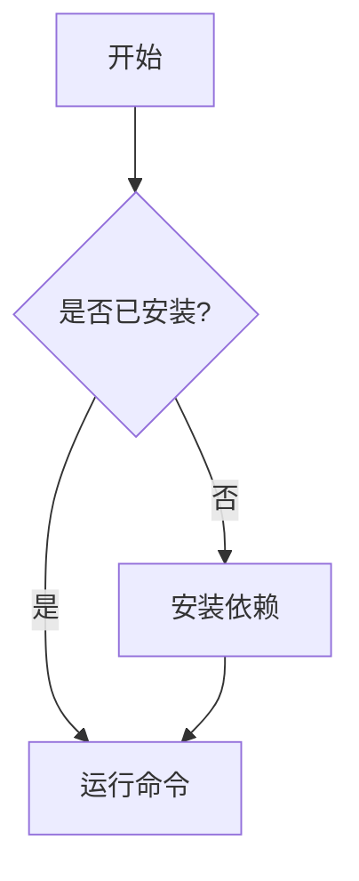

# 双语 README 指南

## 1. 为什么需要双语 README

### 1.1 全球化背景下的文档需求

在当今开源社区蓬勃发展的时代，一个项目的受众往往不仅仅局限于某个国家或地区。对于中国开发者来说，创建双语（中英文）README 文档有以下几个核心价值：

**扩大项目影响力：** 英文是全球开发者社区的通用语言，一份优秀的英文 README 可以让你的项目被全球开发者发现和使用。根据 GitHub 的统计数据，超过 70% 的开源项目使用英文作为主要文档语言。如果你的项目只有中文 README，就等于主动放弃了大部分潜在用户和贡献者。

**降低参与门槛：** 对于中文母语的开发者来说，中文 README 可以大幅降低理解和上手的门槛。即使是英语水平不错的开发者，在阅读技术文档时，母语的理解速度和准确性仍然更高。提供中文版本可以让更多国内开发者快速理解项目价值，并决定是否参与贡献。

**展示专业性：** 一个维护良好的双语 README 向外界传递了项目团队的专业态度和国际化视野。这在商业开源项目中尤为重要，它可以帮助建立品牌信任度，吸引企业用户和赞助商。

**改善 SEO：** 搜索引擎会分别索引不同语言的文档。当用户用中文搜索相关技术时，你的中文 README 有机会出现在搜索结果中，从而带来更多的自然流量。

### 1.2 双语 README 的挑战

虽然双语 README 有很多好处，但也面临一些挑战：

| 挑战 | 说明 | 解决方案 |
|------|------|----------|
| **内容同步** | 两个语言版本需要保持一致 | 建立翻译工作流，使用自动化工具 |
| **维护成本** | 每次更新都需要翻译两次 | 使用机器翻译加人工校对的模式 |
| **排版差异** | 中英文排版习惯不同 | 制定统一的排版规范 |
| **长度差异** | 中文通常比英文更简洁 | 适当调整布局和格式 |
| **术语一致性** | 技术术语翻译需要统一 | 建立术语表 |

### 1.3 什么项目需要双语 README

并非所有项目都需要双语 README。以下情况建议创建双语版本：

- 项目面向全球开发者（如开源工具、框架、库）
- 项目有国际化的用户群体
- 项目团队有多语言成员
- 项目希望吸引海外贡献者
- 项目有商业化的潜力

以下情况可以暂时不需要双语 README：

- 项目仅面向特定地区的用户
- 项目是内部使用的工具
- 项目维护资源有限，无法保证翻译质量

### 1.4 双语 README 的实际案例

许多知名开源项目都采用了双语或多语 README 策略：

- **Vue.js：** 提供了多种语言版本的文档，包括简体中文、日语、韩语等
- **React：** 社区维护了多种语言的翻译版本
- **Flutter：** 官方文档支持多种语言
- **Ant Design：** 中英文双语文档是其一大特色

这些项目的成功经验证明，双语 README 不仅可行，而且能够显著提升项目的国际影响力。

---

## 2. 双语 README 排版方案

### 2.1 方案一：同一文件，语言分区

将两种语言的内容放在同一个 README 文件中，通过明显的分隔符区分。这种方式适合小型项目或文档内容较少的场景。

结构示例：

```markdown
# Project Name / 项目名称

[English](#english) | [中文](#中文)

---

## English

A modern CLI tool for managing development environments.

### Features

- Feature 1: Description
- Feature 2: Description

### Installation

```bash
npm install -g my-tool
```

---

## 中文

一个用于管理开发环境的现代化 CLI 工具。

### 功能特性

- 功能 1：描述
- 功能 2：描述

### 安装

```bash
npm install -g my-tool
```
```

**优点：** 维护简单，只有一个文件；用户可以在同一页面切换语言；不需要额外的文件管理。

**缺点：** 文件较长；GitHub 的语言检测可能不准确（可能识别为非英语项目）；不利于 SEO；当文档内容很多时，文件会变得非常长。

### 2.2 方案二：独立文件，互相链接（推荐）

为每种语言创建独立的 README 文件，并在文件顶部添加语言切换链接。这是最推荐的方案。

目录结构：

```
project-root/
├── README.md           # 英文版（主 README）
├── README.zh-CN.md     # 简体中文版
├── README.zh-TW.md     # 繁体中文版（可选）
├── README.ja.md        # 日文版（可选）
└── README.ko.md        # 韩文版（可选）
```

英文 README.md 示例：

```markdown
# Project Name

[](README.md)
[](README.zh-CN.md)

A modern CLI tool for managing development environments.

## Features

- Feature 1
- Feature 2
- Feature 3

## Installation

```bash
npm install -g my-tool
```

## Usage

```bash
my-tool init
my-tool deploy
```

## Contributing

We welcome contributions! Please read our Contributing Guide first.

## License

MIT
```

中文 README.zh-CN.md 示例：

```markdown
# 项目名称

[](README.md)
[](README.zh-CN.md)

一个用于管理开发环境的现代化 CLI 工具。

## 功能特性

- 功能 1
- 功能 2
- 功能 3

## 安装

```bash
npm install -g my-tool
```

## 使用方法

```bash
my-tool init
my-tool deploy
```

## 贡献指南

欢迎贡献！请先阅读贡献指南。

## 许可证

MIT
```

**优点：** 文件结构清晰；GitHub 语言检测准确；有利于 SEO；每个文件大小适中；便于独立维护。

**缺点：** 维护成本稍高；需要在多个文件之间切换；需要确保内容同步。

### 2.3 方案三：使用 GitHub 原生多语言支持

GitHub 支持为不同语言的用户提供本地化内容。在仓库的 .github 目录下创建语言特定的文件：

```
.github/
├── CODE_OF_CONDUCT.md
├── CODE_OF_CONDUCT.zh-CN.md
├── CONTRIBUTING.md
├── CONTRIBUTING.zh-CN.md
└── ISSUE_TEMPLATE/
    ├── bug_report.yml
    └── bug_report.zh-CN.yml
```

这种方式适合需要为多种文档提供多语言支持的项目。

### 2.4 方案四：使用文档站点工具

对于文档量较大的项目，可以考虑使用专门的文档工具来管理多语言文档：

```
project-root/
├── README.md                 # 简短的项目介绍
├── docs/
│   ├── en/
│   │   ├── getting-started.md
│   │   ├── api-reference.md
│   │   └── examples.md
│   └── zh-CN/
│       ├── getting-started.md
│       ├── api-reference.md
│       └── examples.md
└── docusaurus.config.js      # 或 VuePress、MkDocs 等配置
```

常用的多语言文档工具：

| 工具 | 特点 | 适用场景 |
|------|------|----------|
| **Docusaurus** | React 生态，内置多语言支持 | 大型项目文档 |
| **VuePress** | Vue 生态，简洁易用 | 中小型项目文档 |
| **MkDocs** | Python 生态，Markdown 友好 | 技术文档 |
| **GitBook** | 在线编辑，团队协作 | 商业文档 |
| **VitePress** | Vue 3 生态，速度极快 | 现代项目文档 |

### 2.5 方案选择建议

| 项目规模 | 推荐方案 | 理由 |
|----------|----------|------|
| 小型项目（< 1000 行文档） | 方案一 | 维护简单，一个文件搞定 |
| 中型项目（1000-10000 行） | 方案二 | 结构清晰，便于维护 |
| 大型项目（> 10000 行） | 方案四 | 专业工具支持，功能完善 |
| 开源库/框架 | 方案二 + 方案四 | README 用方案二，详细文档用方案四 |

---

## 3. GitHub 自动语言检测

### 3.1 语言检测机制

GitHub 使用 Linguist 库来检测仓库中使用的编程语言。Linguist 会分析文件扩展名、文件名和文件内容来确定语言类型。

对于 README 文件，GitHub 会根据文件名中的语言代码来识别：

| 文件名 | 语言 | 显示 |
|--------|------|------|
| README.md | 英语（默认） | 主 README |
| README.zh-CN.md | 简体中文 | 中文版 |
| README.zh-TW.md | 繁体中文 | 繁体中文版 |
| README.ja.md | 日语 | 日文版 |
| README.ko.md | 韩语 | 韩文版 |
| README.fr.md | 法语 | 法文版 |
| README.de.md | 德语 | 德文版 |
| README.es.md | 西班牙语 | 西班牙文版 |
| README.pt-BR.md | 巴西葡萄牙语 | 巴西葡语版 |
| README.ru.md | 俄语 | 俄文版 |

### 3.2 优化语言检测

如果你的仓库中有大量非英语文件，可能会影响 GitHub 的语言统计（导致仓库被标记为"中文项目"而非"英语项目"）。可以通过 .gitattributes 文件来调整：

```gitattributes
# 将特定语言的 README 标记为文档（不计入语言统计）
*.zh-CN.md linguist-documentation=true
*.zh-TW.md linguist-documentation=true
*.ja.md linguist-documentation=true
*.ko.md linguist-documentation=true

# 将特定目录标记为文档
docs/** linguist-documentation=true

# 将特定文件标记为生成的代码（不计入语言统计）
src/generated/** linguist-generated=true

# 将 vendored 代码标记为非项目代码
vendor/** linguist-vendored=true
```

### 3.3 在仓库主页显示语言切换

GitHub 会自动在仓库主页显示 README.md 的内容。要让用户能够切换到其他语言版本，可以在 README 顶部添加语言切换链接。

使用 HTML 格式创建居中的语言切换器：

```html
<p align="center">
  <a href="README.md">English</a> &bull;
  <a href="README.zh-CN.md">中文</a> &bull;
  <a href="README.ja.md">日本語</a> &bull;
  <a href="README.ko.md">한국어</a>
</p>
```

### 3.4 使用 shields.io 徽章

使用 shields.io 创建语言切换徽章，更加美观和醒目：

```markdown
[](README.md)
[](README.zh-CN.md)
[](README.ja.md)
[](README.ko.md)
```

还可以使用 flat、plastic 等不同样式：

```markdown


```

---

## 4. 多语言 README 组织方式

### 4.1 文件命名规范

遵循以下命名规范可以保持一致性：

```
# 基本格式
README.<language-code>.md

# 语言代码参考（ISO 639-1 或 IETF BCP 47）
README.zh-CN.md    # 简体中文
README.zh-TW.md    # 繁体中文
README.zh-HK.md    # 香港繁体
README.en.md       # 英语（通常使用 README.md）
README.ja.md       # 日语
README.ko.md       # 韩语
README.fr.md       # 法语
README.de.md       # 德语
README.es.md       # 西班牙语
README.pt-BR.md    # 巴西葡萄牙语
README.ru.md       # 俄语
README.ar.md       # 阿拉伯语
README.it.md       # 意大利语
README.nl.md       # 荷兰语
README.pl.md       # 波兰语
README.th.md       # 泰语
README.vi.md       # 越南语
```

### 4.2 目录结构方案

**方案 A：平铺结构（推荐）**

```
project-root/
├── README.md
├── README.zh-CN.md
├── README.ja.md
└── README.ko.md
```

优点：结构简单，GitHub 能够正确识别，文件易于查找。

**方案 B：translations 目录结构**

```
project-root/
├── README.md
└── translations/
    ├── README.zh-CN.md
    ├── README.ja.md
    └── README.ko.md
```

优点：根目录整洁，翻译文件集中管理。

缺点：GitHub 不会自动识别 translations 目录中的 README，需要在主 README 中手动链接。

**方案 C：docs 目录结构**

```
project-root/
├── README.md
└── docs/
    ├── README.zh-CN.md
    ├── README.ja.md
    └── README.ko.md
```

适合已经使用 docs 目录存放文档的项目。

**推荐使用方案 A**，因为它最简单，且 GitHub 能够正确识别文件名中的语言代码。

### 4.3 多语言文档的内部链接

确保每个语言版本的文档中的链接都指向正确语言的文件：

```markdown
<!-- 英文 README.md -->
## Documentation

- [Getting Started](docs/en/getting-started.md)
- [API Reference](docs/en/api-reference.md)
- [Examples](docs/en/examples.md)
- [中文文档](docs/zh-CN/getting-started.md)
```

```markdown
<!-- 中文 README.zh-CN.md -->
## 文档

- [快速开始](docs/zh-CN/getting-started.md)
- [API 参考](docs/zh-CN/api-reference.md)
- [示例](docs/zh-CN/examples.md)
- [English Documentation](docs/en/getting-started.md)
```

### 4.4 图片和媒体的多语言处理

对于包含截图或图表的文档，可以采用以下策略：

**策略一：使用通用图片**

使用不包含文字的图片，或者使用代码生成的图表。例如使用 Mermaid 图表，因为 Mermaid 可以通过代码生成图表，天然支持多语言：



**策略二：为每种语言提供本地化图片**

```
docs/
├── images/
│   ├── en/
│   │   ├── screenshot-1.png
│   │   └── architecture.svg
│   └── zh-CN/
│       ├── screenshot-1.png
│       └── architecture.svg
```

**策略三：使用动态图片生成**

使用 GitHub Actions 自动生成不同语言版本的截图和图表。

---

## 5. 翻译工作流与工具

### 5.1 翻译工作流

建立一个高效的翻译工作流是维护双语 README 的关键。推荐的工作流程如下：

```
原始文档更新 -> 检测变更 -> 机器翻译 -> 人工校对 -> 提交 PR -> 审查合并
```

**详细步骤：**

1. **原始文档更新：** 维护者更新英文 README（或主要语言版本）
2. **检测变更：** 使用工具检测哪些内容发生了变化，生成 diff
3. **机器翻译：** 使用机器翻译工具生成初稿
4. **人工校对：** 团队成员或社区贡献者校对翻译质量，修正不准确的翻译
5. **提交 PR：** 将校对后的翻译作为 PR 提交
6. **审查合并：** 维护者审查并合并翻译 PR

### 5.2 机器翻译工具对比

| 工具 | 翻译质量 | 价格 | 特点 | 适用场景 |
|------|----------|------|------|----------|
| **DeepL** | 极高 | 付费 API | 支持术语表，翻译最自然 | 专业文档翻译 |
| **Google Translate** | 高 | 免费/付费 | 支持语言最多 | 快速初稿 |
| **OpenAI GPT-4** | 极高 | 付费 API | 上下文理解强，可定制 | 复杂技术内容 |
| **Claude** | 极高 | 付费 API | 长文本处理好 | 长文档翻译 |
| **百度翻译** | 高 | 免费/付费 | 中文翻译质量好 | 中英互译 |
| **有道翻译** | 高 | 免费/付费 | 中文翻译自然 | 中英互译 |
| **腾讯翻译** | 高 | 免费/付费 | 国内访问快 | 中英互译 |
| **阿里翻译** | 高 | 免费/付费 | 国内访问快 | 中英互译 |

### 5.3 使用 GPT 进行翻译的脚本

使用 OpenAI API 进行翻译的 Python 示例脚本：

```python
#!/usr/bin/env python3
"""
translate.py - 使用 OpenAI GPT 翻译 Markdown 文档
用法: python translate.py README.md README.zh-CN.md --source en --target zh-CN
"""

import argparse
import os
import sys

try:
    from openai import OpenAI
except ImportError:
    print("请安装 openai 库: pip install openai")
    sys.exit(1)


SYSTEM_PROMPT = """你是一个专业的技术文档翻译者。请将以下英文技术文档翻译成简体中文。

要求：
1. 保持 Markdown 格式不变
2. 技术术语保持英文或使用业界通用的中文翻译
3. 代码块不翻译
4. 保持专业、准确、流畅的风格
5. 保留所有链接和图片引用
6. 保留所有 HTML 标签
7. 不要添加任何额外的解释或注释"""


def translate_text(client, text, source_lang="English", target_lang="Simplified Chinese"):
    """翻译文本"""
    prompt = f"Translate the following {source_lang} text to {target_lang}:\n\n{text}"

    response = client.chat.completions.create(
        model="gpt-4",
        messages=[
            {"role": "system", "content": SYSTEM_PROMPT},
            {"role": "user", "content": prompt}
        ],
        temperature=0.3
    )

    return response.choices[0].message.content


def main():
    parser = argparse.ArgumentParser(description="翻译 Markdown 文档")
    parser.add_argument("input", help="输入文件路径")
    parser.add_argument("output", help="输出文件路径")
    parser.add_argument("--source", default="en", help="源语言代码")
    parser.add_argument("--target", default="zh-CN", help="目标语言代码")
    args = parser.parse_args()

    # 检查 API Key
    api_key = os.environ.get("OPENAI_API_KEY")
    if not api_key:
        print("错误: 请设置 OPENAI_API_KEY 环境变量")
        sys.exit(1)

    client = OpenAI(api_key=api_key)

    # 读取输入文件
    with open(args.input, "r", encoding="utf-8") as f:
        content = f.read()

    # 翻译
    print(f"正在翻译: {args.input} -> {args.output}")
    translated = translate_text(client, content)

    # 写入输出文件
    with open(args.output, "w", encoding="utf-8") as f:
        f.write(translated)

    print(f"翻译完成: {args.output}")


if __name__ == "__main__":
    main()
```

### 5.4 翻译术语表

建立术语表和翻译记忆库，确保翻译一致性：

```yaml
# glossary.yml - 技术术语翻译对照表
terms:
  - en: repository
    zh-CN: 仓库
    note: Git 仓库

  - en: pull request
    zh-CN: 拉取请求
    note: 可缩写为 PR，不翻译 PR 本身

  - en: branch
    zh-CN: 分支
    note: Git 分支

  - en: commit
    zh-CN: 提交
    note: Git 提交，也可指提交记录

  - en: merge
    zh-CN: 合并
    note: Git 合并操作

  - en: issue
    zh-CN: 问题
    note: GitHub Issue，有时不翻译

  - en: fork
    zh-CN: 复刻
    note: GitHub Fork，也可翻译为派生

  - en: star
    zh-CN: 点赞
    note: GitHub Star

  - en: workflow
    zh-CN: 工作流
    note: GitHub Actions 工作流

  - en: deployment
    zh-CN: 部署
    note: 项目部署

  - en: configuration
    zh-CN: 配置
    note: 项目配置

  - en: dependency
    zh-CN: 依赖
    note: 项目依赖

  - en: release
    zh-CN: 发布
    note: 版本发布

  - en: changelog
    zh-CN: 变更日志
    note: 版本变更记录

  - en: contributing guide
    zh-CN: 贡献指南
    note: 如何参与项目贡献

  - en: code of conduct
    zh-CN: 行为准则
    note: 社区行为规范

  - en: license
    zh-CN: 许可证
    note: 开源许可证

  - en: README
    zh-CN: README
    note: 不翻译，保持原样

  - en: API
    zh-CN: API
    note: 不翻译，保持原样

  - en: CLI
    zh-CN: CLI
    note: 命令行接口，通常不翻译

  - en: SDK
    zh-CN: SDK
    note: 软件开发工具包，通常不翻译

  - en: CI/CD
    zh-CN: CI/CD
    note: 持续集成/持续部署，通常不翻译
```

### 5.5 翻译质量检查脚本

使用脚本检查翻译质量，确保两个版本的文档结构一致：

```python
#!/usr/bin/env python3
"""
check_translation.py - 检查翻译质量
用法: python check_translation.py README.md README.zh-CN.md
"""

import re
import sys


def count_pattern(text, pattern):
    """统计匹配模式的数量"""
    return len(re.findall(pattern, text, re.MULTILINE))


def check_translation(original_file, translated_file):
    """检查翻译质量"""
    with open(original_file, "r", encoding="utf-8") as f:
        original = f.read()
    with open(translated_file, "r", encoding="utf-8") as f:
        translated = f.read()

    issues = []

    # 检查标题数量
    orig_headers = count_pattern(original, r"^#{1,6}\s+.+$")
    trans_headers = count_pattern(translated, r"^#{1,6}\s+.+$")
    if orig_headers != trans_headers:
        issues.append(f"标题数量不一致: 原文 {orig_headers} 个, 译文 {trans_headers} 个")

    # 检查代码块数量
    orig_code = count_pattern(original, r"^```")
    trans_code = count_pattern(translated, r"^```")
    if orig_code != trans_code:
        issues.append(f"代码块数量不一致: 原文 {orig_code // 2} 个, 译文 {trans_code // 2} 个")

    # 检查链接数量
    orig_links = count_pattern(original, r"\[.*?\]\(.*?\)")
    trans_links = count_pattern(translated, r"\[.*?\]\(.*?\)")
    if orig_links != trans_links:
        issues.append(f"链接数量不一致: 原文 {orig_links} 个, 译文 {trans_links} 个")

    # 检查图片数量
    orig_images = count_pattern(original, r"!\[.*?\]\(.*?\)")
    trans_images = count_pattern(translated, r"!\[.*?\]\(.*?\)")
    if orig_images != trans_images:
        issues.append(f"图片数量不一致: 原文 {orig_images} 个, 译文 {trans_images} 个")

    # 检查列表项数量
    orig_lists = count_pattern(original, r"^[\-\*\d+\.]\s+.+$")
    trans_lists = count_pattern(translated, r"^[\-\*\d+\.]\s+.+$")
    if abs(orig_lists - trans_lists) > 2:  # 允许小差异
        issues.append(f"列表项数量差异较大: 原文 {orig_lists} 个, 译文 {trans_lists} 个")

    return issues


def main():
    if len(sys.argv) < 3:
        print("用法: python check_translation.py <原文文件> <译文文件>")
        sys.exit(1)

    original_file = sys.argv[1]
    translated_file = sys.argv[2]

    print(f"检查翻译质量: {original_file} vs {translated_file}")
    print("-" * 50)

    issues = check_translation(original_file, translated_file)

    if issues:
        print("发现以下问题:")
        for i, issue in enumerate(issues, 1):
            print(f"  {i}. {issue}")
        sys.exit(1)
    else:
        print("所有检查通过！翻译质量良好。")
        sys.exit(0)


if __name__ == "__main__":
    main()
```

---

## 6. GitHub Actions 自动翻译

### 6.1 自动翻译工作流

创建一个 GitHub Actions 工作流，当英文 README 更新时自动触发翻译：

```yaml
# .github/workflows/translate-readme.yml
name: 自动翻译 README

on:
  push:
    branches: [main]
    paths: ['README.md']

jobs:
  translate:
    runs-on: ubuntu-latest
    permissions:
      contents: write
      pull-requests: write

    steps:
      - uses: actions/checkout@v4

      - name: 设置 Python
        uses: actions/setup-python@v5
        with:
          python-version: '3.11'

      - name: 安装依赖
        run: pip install openai pyyaml

      - name: 检查变更
        id: changes
        run: |
          git diff HEAD~1 -- README.md > /tmp/changes.diff
          if [ -s /tmp/changes.diff ]; then
            echo "has_changes=true" >> $GITHUB_OUTPUT
          else
            echo "has_changes=false" >> $GITHUB_OUTPUT
          fi

      - name: 翻译 README
        if: steps.changes.outputs.has_changes == 'true'
        env:
          OPENAI_API_KEY: ${{ secrets.OPENAI_API_KEY }}
        run: |
          python scripts/translate.py README.md README.zh-CN.md

      - name: 创建 Pull Request
        if: steps.changes.outputs.has_changes == 'true'
        uses: peter-evans/create-pull-request@v5
        with:
          token: ${{ secrets.GITHUB_TOKEN }}
          commit-message: 'docs: update Chinese README translation'
          title: 'docs: 更新中文 README 翻译'
          body: |
            此 PR 由 GitHub Actions 自动生成，更新了中文 README 的翻译。

            请审查翻译质量并合并。
          branch: auto-translate/readme-zh-cn
          delete-branch: true
```

### 6.2 使用 DeepL API 翻译

DeepL 是目前翻译质量最高的机器翻译工具之一，特别适合技术文档翻译：

```yaml
# .github/workflows/translate-deepl.yml
name: DeepL 自动翻译

on:
  push:
    branches: [main]
    paths: ['README.md']

jobs:
  translate:
    runs-on: ubuntu-latest
    steps:
      - uses: actions/checkout@v4

      - name: 安装 DeepL CLI
        run: |
          wget https://github.com/DeepLcom/deepl-cli/releases/latest/download/deepl_linux_x86_64
          chmod +x deepl_linux_x86_64
          sudo mv deepl_linux_x86_64 /usr/local/bin/deepl

      - name: 翻译 README
        env:
          DEEPL_AUTH_KEY: ${{ secrets.DEEPL_AUTH_KEY }}
        run: |
          deepl --from EN --to ZH README.md > README.zh-CN.md

      - name: 提交翻译
        run: |
          git config user.name "github-actions[bot]"
          git config user.email "github-actions[bot]@users.noreply.github.com"
          git add README.zh-CN.md
          git diff --cached --quiet || git commit -m "docs: update Chinese README translation"
          git push
```

### 6.3 使用 GitHub Actions Marketplace 的翻译 Action

```yaml
# .github/workflows/translate-action.yml
name: 使用社区 Action 翻译

on:
  push:
    branches: [main]
    paths: ['README.md']

jobs:
  translate:
    runs-on: ubuntu-latest
    steps:
      - uses: actions/checkout@v4

      - name: 翻译到多种语言
        uses: mefengl/auto-translate@v1
        with:
          from: 'en'
          to: 'zh-CN'
          path: 'README.md'
          output: 'README.zh-CN.md'
```

### 6.4 翻译质量自动检查

在 PR 中自动检查翻译质量：

```yaml
# .github/workflows/check-translation.yml
name: 翻译质量检查

on:
  pull_request:
    paths:
      - 'README.zh-CN.md'
      - 'README.ja.md'
      - 'README.ko.md'

jobs:
  check:
    runs-on: ubuntu-latest
    steps:
      - uses: actions/checkout@v4

      - name: 设置 Python
        uses: actions/setup-python@v5
        with:
          python-version: '3.11'

      - name: 检查翻译质量
        run: |
          python scripts/check_translation.py README.md README.zh-CN.md

      - name: 检查翻译是否过时
        run: |
          en_date=$(git log -1 --format="%at" -- README.md)
          zh_date=$(git log -1 --format="%at" -- README.zh-CN.md)
          diff=$((en_date - zh_date))
          days=$((diff / 86400))
          if [ $days -gt 30 ]; then
            echo "::warning::中文 README 已过期 ${days} 天，请及时更新翻译！"
          fi
```

---

## 7. 双语文档的维护策略

### 7.1 维护原则

**原则一：单一事实来源**

确定一个主要语言版本作为"事实来源"（通常是英文），其他语言版本基于它进行翻译。避免在不同语言版本中添加独立的内容，这会导致版本不一致。

**原则二：同步更新**

当主要语言版本更新时，应在合理的时间内（如 1-2 周）更新其他语言版本。可以设置自动化提醒机制。

**原则三：质量优先**

宁可不提供翻译，也不要提供低质量的翻译。低质量的机器翻译会误导用户，损害项目声誉。建议采用"机器翻译 + 人工校对"的模式。

**原则四：社区参与**

鼓励社区贡献翻译，并为翻译贡献者提供认可。可以在 README 中列出翻译贡献者：

```markdown
## 翻译贡献者

感谢以下贡献者帮助翻译本文档：

- [@contributor1](https://github.com/contributor1) - 中文翻译
- [@contributor2](https://github.com/contributor2) - 日文翻译
- [@contributor3](https://github.com/contributor3) - 韩文翻译
```

### 7.2 版本控制策略

为不同语言版本的文档建立清晰的版本控制策略：

**策略一：同一分支（推荐）**

所有语言版本在同一个分支中维护，变更通过 PR 进行审查。

**策略二：独立分支**

每种语言版本在独立的分支中维护，适合大型团队。

**策略三：使用标签**

为每个发布版本打标签，确保文档版本与软件版本对应。

### 7.3 翻译更新提醒

使用 GitHub Actions 定期检查翻译是否过期：

```yaml
# .github/workflows/translation-reminder.yml
name: 翻译更新提醒

on:
  schedule:
    - cron: '0 9 * * 1'  # 每周一早上 9 点

jobs:
  remind:
    runs-on: ubuntu-latest
    steps:
      - uses: actions/checkout@v4

      - name: 检查翻译是否过时
        run: |
          check_freshness() {
            local original=$1
            local translated=$2
            local lang=$3
            local threshold=$4

            en_date=$(git log -1 --format="%at" -- "$original")
            zh_date=$(git log -1 --format="%at" -- "$translated")

            if [ -z "$zh_date" ]; then
              echo "⚠️ ${lang} 版本不存在"
              return
            fi

            diff=$((en_date - zh_date))
            days=$((diff / 86400))

            if [ $days -gt $threshold ]; then
              echo "⚠️ ${lang} README 已过期 ${days} 天，请及时更新翻译！"
            else
              echo "✅ ${lang} README 更新及时（${days} 天前更新）"
            fi
          }

          check_freshness README.md README.zh-CN.md "中文" 7
          check_freshness README.md README.ja.md "日文" 14
          check_freshness README.md README.ko.md "韩文" 14
```

### 7.4 贡献者指南中的翻译说明

在 CONTRIBUTING.md 中添加翻译相关的说明：

```markdown
## 翻译贡献

我们欢迎社区贡献翻译！请遵循以下步骤：

1. Fork 本仓库
2. 基于英文 README 创建翻译版本
3. 确保翻译质量：
   - 保持 Markdown 格式不变
   - 代码块不翻译
   - 使用术语表中的标准翻译
   - 保留所有链接和图片引用
4. 提交 Pull Request

### 翻译规范

- 文件命名：README.<语言代码>.md
- 语言代码使用 ISO 639-1 标准
- 在文件顶部添加语言切换链接
- 保持与英文版本的结构一致

### 术语表

请参考 glossary.yml 中的术语对照表，确保翻译一致性。
```

---

## 8. 中英文排版规范

### 8.1 中文排版基本规则

在中文技术文档中，遵循以下排版规范可以提升文档的可读性和专业性：

**中英文之间加空格：**

```markdown
# 不推荐
这是一个GitHub项目

# 推荐
这是一个 GitHub 项目
```

**数字与中文之间加空格：**

```markdown
# 不推荐
项目有3个主要功能

# 推荐
项目有 3 个主要功能
```

**标点符号使用中文全角：**

```markdown
# 不推荐
这是一个项目.它有很多功能.

# 推荐
这是一个项目。它有很多功能。
```

**专有名词保持原样：**

```markdown
# 不推荐
使用盖特进行版本控制

# 推荐
使用 Git 进行版本控制
```

**完整的标点符号对照：**

| 中文 | 英文 | 说明 |
|------|------|------|
| ， | , | 逗号 |
| 。 | . | 句号 |
| ； | ; | 分号 |
| ： | : | 冒号 |
| ？ | ? | 问号 |
| ！ | ! | 感叹号 |
| （ ） | ( ) | 括号 |
| 「 」 | " " | 引号 |
| 《 》 | < > | 书名号 |
| —— | -- | 破折号 |
| …… | ... | 省略号 |

### 8.2 英文排版基本规则

**句子首字母大写：**

```markdown
# 不推荐
this is a project.

# 推荐
This is a project.
```

**专有名词正确大小写：**

```markdown
# 不推荐
github, javascript, typescript

# 推荐
GitHub, JavaScript, TypeScript
```

**常见的大小写错误：**

| 错误 | 正确 | 说明 |
|------|------|------|
| github | GitHub | 公司名 |
| javascript | JavaScript | 语言名 |
| typescript | TypeScript | 语言名 |
| nodejs | Node.js | 运行时名 |
| npm | npm | 全小写（官方规范） |
| webpack | webpack | 全小写（官方规范） |
| vuejs | Vue.js | 框架名 |
| reactjs | React | 框架名 |
| angularjs | Angular | 框架名 |
| docker | Docker | 容器平台 |
| kubernetes | Kubernetes | 容器编排 |
| json | JSON | 数据格式 |
| yaml | YAML | 数据格式 |
| api | API | 缩写全大写 |
| cli | CLI | 缩写全大写 |
| ide | IDE | 缩写全大写 |
| html | HTML | 缩写全大写 |
| css | CSS | 缩写全大写 |
| url | URL | 缩写全大写 |
| http | HTTP | 缩写全大写 |
| https | HTTPS | 缩写全大写 |
| ssh | SSH | 缩写全大写 |
| git | Git | 版本控制 |
| linux | Linux | 操作系统 |
| macos | macOS | 操作系统 |
| windows | Windows | 操作系统 |
| ios | iOS | 操作系统 |
| android | Android | 操作系统 |

### 8.3 代码相关排版

**行内代码使用反引号：**

```markdown
使用 `npm install` 安装依赖。
```

**代码块指定语言：**

````markdown
```javascript
const greeting = "Hello, World!";
console.log(greeting);
```
````

**文件路径使用行内代码：**

```markdown
配置文件位于 `config/settings.yml`。
```

**命令行示例使用 bash 代码块：**

````markdown
```bash
# 安装依赖
npm install

# 启动开发服务器
npm run dev
```
````

### 8.4 链接和图片

**链接文本要有描述性：**

```markdown
# 不推荐
点击[这里](https://docs.example.com)查看文档。

# 推荐
查看[官方文档](https://docs.example.com)获取更多信息。
```

**图片添加替代文本：**

```markdown
# 不推荐


# 推荐

```

---

## 9. 实战模板

### 9.1 完整的英文 README 模板

```markdown
# Project Name

[](README.md)
[](README.zh-CN.md)
[](LICENSE)
[](https://github.com/owner/repo/actions)
[](https://www.npmjs.com/package/package-name)

A brief description of what this project does and why it is useful.

## Features

- **Feature 1**: Description of feature 1
- **Feature 2**: Description of feature 2
- **Feature 3**: Description of feature 3

## Quick Start

### Prerequisites

- Node.js >= 18
- npm >= 9

### Installation

```bash
npm install package-name
```

### Usage

```javascript
import { myFunction } from 'package-name';

const result = myFunction();
console.log(result);
```

## Documentation

- [Getting Started](docs/getting-started.md)
- [API Reference](docs/api-reference.md)
- [Examples](docs/examples.md)
- [FAQ](docs/faq.md)

## Contributing

Contributions are welcome! Please read our [Contributing Guide](CONTRIBUTING.md) first.

## License

[MIT](LICENSE)

## Acknowledgments

- Thanks to all [contributors](https://github.com/owner/repo/graphs/contributors)
- Inspired by [other-project](https://github.com/other/project)
```

### 9.2 完整的中文 README 模板

```markdown
# 项目名称

[](README.md)
[](README.zh-CN.md)
[](LICENSE)
[](https://github.com/owner/repo/actions)
[](https://www.npmjs.com/package/package-name)

简要描述这个项目做什么以及为什么有用。

## 功能特性

- **功能 1**：功能 1 的描述
- **功能 2**：功能 2 的描述
- **功能 3**：功能 3 的描述

## 快速开始

### 环境要求

- Node.js >= 18
- npm >= 9

### 安装

```bash
npm install package-name
```

### 使用方法

```javascript
import { myFunction } from 'package-name';

const result = myFunction();
console.log(result);
```

## 文档

- [快速开始](docs/zh-CN/getting-started.md)
- [API 参考](docs/zh-CN/api-reference.md)
- [示例](docs/zh-CN/examples.md)
- [常见问题](docs/zh-CN/faq.md)

## 贡献指南

欢迎贡献！请先阅读[贡献指南](CONTRIBUTING.md)。

## 许可证

[MIT](LICENSE)

## 致谢

- 感谢所有[贡献者](https://github.com/owner/repo/graphs/contributors)
- 灵感来源于 [other-project](https://github.com/other/project)
```

### 9.3 多语言 README 的完整示例

以下是一个完整的多语言 README 项目的目录结构和文件内容示例：

```
my-project/
├── README.md                 # 英文版
├── README.zh-CN.md           # 简体中文版
├── README.ja.md              # 日文版
├── .gitattributes            # 语言检测配置
├── glossary.yml              # 术语表
├── scripts/
│   ├── translate.py          # 翻译脚本
│   └── check_translation.py  # 质量检查脚本
├── .github/
│   └── workflows/
│       ├── translate.yml     # 自动翻译工作流
│       └── check.yml         # 质量检查工作流
└── docs/
    ├── en/
    │   └── ...
    └── zh-CN/
        └── ...
```

### 9.4 使用 Docusaurus 构建多语言文档站点

对于需要更完整多语言支持的项目，推荐使用 Docusaurus：

```javascript
// docusaurus.config.js
module.exports = {
  title: 'My Project',
  tagline: 'A modern tool for developers',
  url: 'https://my-project.com',
  baseUrl: '/',

  i18n: {
    defaultLocale: 'en',
    locales: ['en', 'zh-CN', 'ja', 'ko'],
    localeConfigs: {
      en: { label: 'English' },
      'zh-CN': { label: '简体中文' },
      ja: { label: '日本語' },
      ko: { label: '한국어' },
    },
  },

  themeConfig: {
    navbar: {
      items: [
        {
          type: 'localeDropdown',
          position: 'right',
        },
      ],
    },
  },
};
```

对应的目录结构：

```
docs/
├── intro.md              # 英文版
├── getting-started.md    # 英文版
i18n/
├── zh-CN/
│   ├── docusaurus-plugin-content-docs/
│   │   └── current/
│   │       ├── intro.md
│   │       └── getting-started.md
│   └── docusaurus-theme-classic/
│       └── navbar.json
├── ja/
│   └── ...
└── ko/
    └── ...
```

### 9.5 最佳实践总结

1. **选择合适的方案：** 根据项目规模和团队能力选择最合适的多语言方案
2. **保持结构一致：** 所有语言版本应保持相同的章节结构
3. **使用术语表：** 建立统一的术语翻译表，确保一致性
4. **自动化翻译：** 使用 GitHub Actions 实现翻译自动化
5. **质量检查：** 使用脚本自动检查翻译质量
6. **社区参与：** 鼓励社区贡献翻译，降低维护负担
7. **定期更新：** 设置提醒机制，确保翻译不会过期
8. **排版规范：** 遵循中英文排版规范，提升文档专业性
9. **SEO 优化：** 使用独立文件方案，便于搜索引擎索引
10. **徽章切换：** 在 README 顶部添加醒目的语言切换链接

---

## 总结

双语 README 是开源项目国际化的重要一步。通过本文介绍的方法和工具，你可以：

1. **选择合适的排版方案：** 根据项目规模选择同一文件或多文件方案
2. **利用 GitHub 特性：** 使用文件命名规范让 GitHub 识别多语言版本
3. **建立翻译工作流：** 使用机器翻译加人工校对的模式提高效率
4. **自动化翻译流程：** 使用 GitHub Actions 实现翻译自动化
5. **保证翻译质量：** 使用质量检查脚本确保结构一致性
6. **遵循排版规范：** 中英文排版规范化，提升文档专业性

记住，好的双语 README 不仅仅是翻译，更是一种对全球开发者的尊重和邀请。投入时间和精力维护高质量的多语言文档，将会为你的项目带来更广泛的影响力和更多的贡献者。

## 10. 高级主题与进阶技巧

### 10.1 使用 GitHub Discussions 进行多语言社区管理

除了 README 文件，GitHub Discussions 也是多语言社区管理的重要场所：

```yaml
# .github/DISCUSSION_CATEGORY.yml
- name: Q&A / 问答
  description: Ask questions and get help / 提问和获取帮助
  emoji: "💬"

- name: Ideas / 想法
  description: Share your ideas / 分享你的想法
  emoji: "💡"

- name: Show and Tell / 展示
  description: Show off your projects / 展示你的项目
  emoji: "🎉"
```

### 10.2 多语言贡献者指南

为不同语言的贡献者提供专门的贡献指南：

```markdown
# CONTRIBUTING.md

## 贡献指南 / Contributing Guide

[English](#english) | [中文](#中文)

---

### English

Welcome! We're excited that you want to contribute.

#### How to Contribute

1. Fork the repository
2. Create a feature branch
3. Make your changes
4. Submit a Pull Request

#### Translation Contributions

We welcome translations! Please follow these guidelines:
- Use the template from `docs/translations/template.md`
- Maintain the same structure as the English version
- Don't translate code blocks
- Use the glossary in `glossary.yml` for consistent terminology

---

### 中文

欢迎！我们很高兴你想参与贡献。

#### 如何贡献

1. 复刻（Fork）本仓库
2. 创建功能分支
3. 进行修改
4. 提交拉取请求（Pull Request）

#### 翻译贡献

我们欢迎翻译贡献！请遵循以下指南：
- 使用 `docs/translations/template.md` 中的模板
- 保持与英文版本相同的结构
- 不要翻译代码块
- 使用 `glossary.yml` 中的术语表确保翻译一致性
```

### 10.3 自动化翻译质量保障

建立完善的自动化翻译质量保障体系：

```yaml
# .github/workflows/translation-quality.yml
name: Translation Quality Assurance

on:
  pull_request:
    paths:
      - 'README*.md'
      - 'docs/**/*.md'

jobs:
  quality-check:
    runs-on: ubuntu-latest
    steps:
      - uses: actions/checkout@v4

      - name: Check Translation Consistency
        run: |
          # 检查所有翻译版本的结构一致性
          for translated in README.zh-CN.md README.ja.md README.ko.md; do
            if [ -f "$translated" ]; then
              echo "检查 $translated..."

              # 检查标题数量
              en_headers=$(grep -c '^#' README.md)
              trans_headers=$(grep -c '^#' "$translated")
              if [ "$en_headers" != "$trans_headers" ]; then
                echo "::warning file=$translated::标题数量不一致: 英文 $en_headers, 翻译 $trans_headers"
              fi

              # 检查代码块数量
              en_code=$(grep -c '```' README.md)
              trans_code=$(grep -c '```' "$translated")
              if [ "$en_code" != "$trans_code" ]; then
                echo "::warning file=$translated::代码块数量不一致: 英文 $en_code, 翻译 $trans_code"
              fi
            fi
          done

      - name: Check Terminology Consistency
        run: |
          # 检查术语翻译是否与术语表一致
          if [ -f glossary.yml ]; then
            echo "检查术语一致性..."
            # 使用 Python 脚本进行术语检查
            python scripts/check_terminology.py
          fi

      - name: Check Link Validity
        run: |
          # 检查翻译版本中的链接是否有效
          for translated in README.zh-CN.md README.ja.md README.ko.md; do
            if [ -f "$translated" ]; then
              echo "检查 $translated 中的链接..."
              # 提取并验证链接
              grep -oP '\[.*?\]\((.*?)\)' "$translated" | while read -r link; do
                url=$(echo "$link" | grep -oP '\((.*?)\)' | tr -d '()')
                if [[ "$url" == http* ]]; then
                  curl -s -o /dev/null -w "%{http_code}" "$url" | grep -q "200\|301\|302" || \
                    echo "::warning file=$translated::链接可能无效: $url"
                fi
              done
            fi
          done
```

### 10.4 多语言 SEO 优化

为不同语言版本的文档进行 SEO 优化：

```html
<!-- 在 README.md 中添加 SEO 相关的 HTML 标签 -->
<!-- 注意：GitHub 会过滤大部分 HTML 标签，但以下标签是支持的 -->

<p align="center">
  <strong>A modern CLI tool for managing development environments</strong>
</p>

<p align="center">
  <a href="README.md">English</a> |
  <a href="README.zh-CN.md">中文</a> |
  <a href="README.ja.md">日本語</a>
</p>
```

使用 `.gitattributes` 优化 GitHub 的语言识别：

```gitattributes
# 告诉 GitHub 这些文件是文档，不应计入语言统计
README.zh-CN.md linguist-documentation=true
README.ja.md linguist-documentation=true
README.ko.md linguist-documentation=true

# 确保 GitHub 正确识别项目的主要语言
*.js linguist-detectable=true
*.ts linguist-detectable=true
```

### 10.5 国际化文档站点架构

对于大型项目，建立完善的国际化文档站点架构：

```
project/
├── website/
│   ├── i18n/
│   │   ├── en/
│   │   │   ├── docusaurus-plugin-content-docs/
│   │   │   │   └── current/
│   │   │   │       ├── getting-started.md
│   │   │   │       ├── api-reference.md
│   │   │   │       └── examples.md
│   │   │   └── docusaurus-theme-classic/
│   │   │       ├── navbar.json
│   │   │       └── footer.json
│   │   ├── zh-CN/
│   │   │   ├── docusaurus-plugin-content-docs/
│   │   │   │   └── current/
│   │   │   │       ├── getting-started.md
│   │   │   │       ├── api-reference.md
│   │   │   │       └── examples.md
│   │   │   └── docusaurus-theme-classic/
│   │   │       ├── navbar.json
│   │   │       └── footer.json
│   │   └── ja/
│   │       └── ...
│   ├── src/
│   ├── static/
│   ├── docusaurus.config.js
│   └── package.json
├── README.md
└── README.zh-CN.md
```

Docusaurus 多语言配置示例：

```javascript
// docusaurus.config.js
module.exports = {
  i18n: {
    defaultLocale: 'en',
    locales: ['en', 'zh-CN', 'ja'],
    localeConfigs: {
      en: {
        label: 'English',
        direction: 'ltr',
        htmlLang: 'en-US',
      },
      'zh-CN': {
        label: '简体中文',
        direction: 'ltr',
        htmlLang: 'zh-CN',
      },
      ja: {
        label: '日本語',
        direction: 'ltr',
        htmlLang: 'ja',
      },
    },
  },
  themeConfig: {
    navbar: {
      items: [
        {
          type: 'localeDropdown',
          position: 'right',
        },
      ],
    },
  },
};
```

### 10.6 翻译记忆库与术语管理

建立企业级的翻译记忆库和术语管理系统：

```yaml
# glossary.yml - 完整的术语管理文件
metadata:
  project: "My Project"
  version: "1.0"
  last_updated: "2024-01-15"

terms:
  # Git 相关术语
  - en: repository
    zh-CN: 仓库
    ja: リポジトリ
    ko: 저장소
    context: Git repository
    notes: 不翻译时保持 "repository"

  - en: commit
    zh-CN: 提交
    ja: コミット
    ko: 커밋
    context: Git commit
    notes: 作为名词时翻译为"提交"或"提交记录"

  - en: pull request
    zh-CN: 拉取请求
    ja: プルリクエスト
    ko: 풀 리퀘스트
    context: GitHub Pull Request
    notes: 可缩写为 PR，不翻译 PR 本身

  - en: branch
    zh-CN: 分支
    ja: ブランチ
    ko: 브랜치
    context: Git branch

  - en: merge
    zh-CN: 合并
    ja: マージ
    ko: 머지
    context: Git merge

  - en: fork
    zh-CN: 复刻
    ja: フォーク
    ko: 포크
    context: GitHub Fork
    notes: 也可翻译为"派生"

  - en: issue
    zh-CN: 问题
    ja: イシュー
    ko: 이슈
    context: GitHub Issue
    notes: 有时不翻译，保持 "Issue"

  - en: star
    zh-CN: 点赞
    ja: スター
    ko: 스타
    context: GitHub Star

  # 技术术语
  - en: API
    zh-CN: API
    ja: API
    ko: API
    notes: 不翻译，保持原样

  - en: CLI
    zh-CN: CLI
    ja: CLI
    ko: CLI
    context: Command Line Interface
    notes: 不翻译，保持原样

  - en: SDK
    zh-CN: SDK
    ja: SDK
    ko: SDK
    context: Software Development Kit
    notes: 不翻译，保持原样

  - en: CI/CD
    zh-CN: CI/CD
    ja: CI/CD
    ko: CI/CD
    context: Continuous Integration/Continuous Deployment
    notes: 不翻译，保持原样

  - en: container
    zh-CN: 容器
    ja: コンテナ
    ko: 컨테이너
    context: Docker container

  - en: deployment
    zh-CN: 部署
    ja: デプロイメント
    ko: 배포
    context: Application deployment

  - en: configuration
    zh-CN: 配置
    ja: 設定
    ko: 구성
    context: System configuration

  - en: dependency
    zh-CN: 依赖
    ja: 依存関係
    ko: 의존성
    context: Package dependency

  - en: release
    zh-CN: 发布
    ja: リリース
    ko: 릴리스
    context: Version release

  - en: changelog
    zh-CN: 变更日志
    ja: 変更履歴
    ko: 변경 로그
    context: Version changelog

  - en: contributing guide
    zh-CN: 贡献指南
    ja: コントリビューションガイド
    ko: 기여 가이드
    context: How to contribute

  - en: code of conduct
    zh-CN: 行为准则
    ja: 行動規範
    ko: 행동 강령
    context: Community code of conduct

  - en: license
    zh-CN: 许可证
    ja: ライセンス
    ko: 라이선스
    context: Open source license
```

### 10.7 翻译贡献者认可体系

建立完善的翻译贡献者认可体系，激励社区参与翻译：

```markdown
## Translation Contributors / 翻译贡献者

We thank the following contributors for their translation work:
感谢以下贡献者的翻译工作：

### 简体中文 (Simplified Chinese)
- [@contributor1](https://github.com/contributor1) - Main translator / 主要翻译者
- [@contributor2](https://github.com/contributor2) - Reviewer / 审校者
- [@contributor3](https://github.com/contributor3) - Contributor / 贡献者

### 日本語 (Japanese)
- [@contributor4](https://github.com/contributor4) - Main translator / 主要翻訳者
- [@contributor5](https://github.com/contributor5) - Reviewer / レビュアー

### 한국어 (Korean)
- [@contributor6](https://github.com/contributor6) - Main translator / 주요 번역자

---

Want to help translate? See our [Translation Guide](docs/translations/README.md).
想帮助翻译？请查看我们的[翻译指南](docs/translations/README.md)。
```

### 10.8 多语言文档的测试策略

为多语言文档建立测试策略，确保翻译质量：

```python
#!/usr/bin/env python3
"""
test_translations.py - 翻译质量测试
"""

import os
import re
import pytest


def get_readme_files():
    """获取所有 README 文件"""
    files = []
    for f in os.listdir('.'):
        if f.startswith('README') and f.endswith('.md'):
            files.append(f)
    return files


def count_pattern(content, pattern):
    """统计匹配模式的数量"""
    return len(re.findall(pattern, content, re.MULTILINE))


def read_file(filepath):
    """读取文件内容"""
    with open(filepath, 'r', encoding='utf-8') as f:
        return f.read()


class TestTranslationQuality:
    """翻译质量测试类"""

    @pytest.fixture
    def english_readme(self):
        return read_file('README.md')

    @pytest.fixture
    def translated_readmes(self):
        files = {}
        for f in get_readme_files():
            if f != 'README.md':
                files[f] = read_file(f)
        return files

    def test_headers_count(self, english_readme, translated_readmes):
        """测试标题数量一致性"""
        en_count = count_pattern(english_readme, r'^#{1,6}\s+.+$')
        for filename, content in translated_readmes.items():
            trans_count = count_pattern(content, r'^#{1,6}\s+.+$')
            assert en_count == trans_count, \
                f"{filename}: 标题数量不一致 (英文: {en_count}, 翻译: {trans_count})"

    def test_code_blocks_count(self, english_readme, translated_readmes):
        """测试代码块数量一致性"""
        en_count = count_pattern(english_readme, r'^```') // 2
        for filename, content in translated_readmes.items():
            trans_count = count_pattern(content, r'^```') // 2
            assert en_count == trans_count, \
                f"{filename}: 代码块数量不一致 (英文: {en_count}, 翻译: {trans_count})"

    def test_links_count(self, english_readme, translated_readmes):
        """测试链接数量一致性"""
        en_count = count_pattern(english_readme, r'\[.*?\]\(.*?\)')
        for filename, content in translated_readmes.items():
            trans_count = count_pattern(content, r'\[.*?\]\(.*?\)')
            # 允许小差异（语言切换链接）
            assert abs(en_count - trans_count) <= 2, \
                f"{filename}: 链接数量差异过大 (英文: {en_count}, 翻译: {trans_count})"

    def test_no_untranslated_headers(self, translated_readmes):
        """测试没有未翻译的标题"""
        for filename, content in translated_readmes.items():
            # 检查是否有纯英文标题（可能是忘记翻译的）
            headers = re.findall(r'^#+\s+(.+)$', content, re.MULTILINE)
            for header in headers:
                # 如果标题完全是英文字母和空格，可能是忘记翻译
                if re.match(r'^[A-Za-z\s]+$', header.strip()):
                    # 但要排除常见的英文标题（如 API、FAQ 等）
                    if header.strip() not in ['API', 'FAQ', 'CLI', 'SDK', 'CI/CD']:
                        pytest.warn(f"{filename}: 标题可能未翻译: {header}")


if __name__ == '__main__':
    pytest.main([__file__, '-v'])
```

### 10.9 使用 AI 辅助翻译的最佳实践

结合 AI 工具提升翻译效率和质量：

```python
#!/usr/bin/env python3
"""
ai_translate.py - 使用 AI 进行智能翻译
"""

import os
import json
from typing import List, Dict

try:
    from openai import OpenAI
except ImportError:
    print("请安装 openai 库: pip install openai")
    exit(1)


class AITranslator:
    """AI 翻译器"""

    def __init__(self, glossary_path: str = "glossary.yml"):
        self.client = OpenAI(api_key=os.environ.get("OPENAI_API_KEY"))
        self.glossary = self._load_glossary(glossary_path)

    def _load_glossary(self, path: str) -> Dict:
        """加载术语表"""
        import yaml
        if os.path.exists(path):
            with open(path, 'r', encoding='utf-8') as f:
                return yaml.safe_load(f)
        return {"terms": []}

    def _build_glossary_prompt(self) -> str:
        """构建术语表提示"""
        if not self.glossary.get("terms"):
            return ""

        lines = ["术语对照表:"]
        for term in self.glossary["terms"]:
            en = term.get("en", "")
            zh = term.get("zh-CN", "")
            if en and zh:
                lines.append(f"- {en} -> {zh}")

        return "\n".join(lines)

    def translate(self, text: str, source_lang: str = "English",
                  target_lang: str = "Simplified Chinese") -> str:
        """翻译文本"""
        glossary_prompt = self._build_glossary_prompt()

        system_prompt = f"""你是一个专业的技术文档翻译者。请将以下{source_lang}技术文档翻译成{target_lang}。

要求：
1. 保持 Markdown 格式不变
2. 技术术语保持英文或使用业界通用的中文翻译
3. 代码块不翻译
4. 保持专业、准确、流畅的风格
5. 保留所有链接和图片引用
6. 保留所有 HTML 标签
7. 不要添加任何额外的解释或注释

{glossary_prompt}"""

        response = self.client.chat.completions.create(
            model="gpt-4",
            messages=[
                {"role": "system", "content": system_prompt},
                {"role": "user", "content": f"请翻译以下内容:\n\n{text}"}
            ],
            temperature=0.3
        )

        return response.choices[0].message.content


def main():
    """主函数"""
    import argparse

    parser = argparse.ArgumentParser(description="AI 翻译工具")
    parser.add_argument("input", help="输入文件路径")
    parser.add_argument("output", help="输出文件路径")
    parser.add_argument("--glossary", default="glossary.yml", help="术语表路径")
    args = parser.parse_args()

    translator = AITranslator(args.glossary)

    with open(args.input, 'r', encoding='utf-8') as f:
        content = f.read()

    print(f"正在翻译: {args.input}")
    translated = translator.translate(content)

    with open(args.output, 'w', encoding='utf-8') as f:
        f.write(translated)

    print(f"翻译完成: {args.output}")


if __name__ == "__main__":
    main()
```

---

## 总结

双语 README 是开源项目国际化的重要一步。通过本文介绍的方法和工具，你可以：

1. **选择合适的排版方案：** 根据项目规模选择同一文件或多文件方案，推荐使用独立文件方案
2. **利用 GitHub 特性：** 使用文件命名规范让 GitHub 识别多语言版本，通过 .gitattributes 优化语言检测
3. **建立翻译工作流：** 使用机器翻译加人工校对的模式提高效率，建立术语表确保一致性
4. **自动化翻译流程：** 使用 GitHub Actions 实现翻译自动化，设置质量检查和更新提醒
5. **保证翻译质量：** 使用质量检查脚本确保结构一致性，建立测试策略验证翻译质量
6. **遵循排版规范：** 中英文排版规范化，提升文档专业性和可读性
7. **建立社区认可：** 为翻译贡献者提供认可，激励社区参与翻译工作
8. **持续优化改进：** 定期审查翻译质量，根据反馈持续优化翻译流程

记住，好的双语 README 不仅仅是翻译，更是一种对全球开发者的尊重和邀请。投入时间和精力维护高质量的多语言文档，将会为你的项目带来更广泛的影响力和更多的贡献者。在实践中，建议从核心文档开始，逐步扩展到完整的多语言支持，同时建立可持续的翻译维护机制。

## 11. 附录：多语言文档工具与资源

### 11.1 推荐的翻译工具

| 工具名称 | 类型 | 特点 | 适用场景 |
|----------|------|------|----------|
| DeepL | 在线/API | 翻译质量最高 | 专业文档翻译 |
| Google Translate | 在线/API | 支持语言最多 | 快速初稿 |
| OpenAI GPT-4 | API | 上下文理解强 | 复杂技术内容 |
| Claude | API | 长文本处理好 | 长文档翻译 |
| 百度翻译 | 在线/API | 中文翻译好 | 中英互译 |
| 有道翻译 | 在线/API | 中文自然 | 中英互译 |
| Crowdin | 平台 | 专业翻译管理 | 大型项目 |
| Transifex | 平台 | 团队协作 | 商业项目 |
| Lokalise | 平台 | 移动应用友好 | 应用本地化 |

### 11.2 推荐的文档工具

| 工具名称 | 特点 | 多语言支持 | 适用场景 |
|----------|------|-----------|----------|
| Docusaurus | React 生态，功能完善 | 内置多语言 | 大型项目文档 |
| VuePress | Vue 生态，简洁易用 | 插件支持 | 中小型项目 |
| VitePress | Vue 3 生态，速度极快 | 插件支持 | 现代项目文档 |
| MkDocs | Python 生态，Markdown 友好 | 插件支持 | 技术文档 |
| GitBook | 在线编辑，团队协作 | 内置多语言 | 商业文档 |
| Sphinx | Python 生态，功能强大 | 内置多语言 | Python 项目 |

### 11.3 推荐的排版检查工具

| 工具名称 | 功能 | 适用语言 |
|----------|------|----------|
| markdownlint | Markdown 格式检查 | 所有语言 |
| textlint | 自然语言检查 | 多语言支持 |
| proselint | 英文写作检查 | 英文 |
| write-good | 英文写作风格检查 | 英文 |
| pangu.js | 中英文间加空格 | 中英文混合 |

### 11.4 常用语言代码参考

| 语言代码 | 语言名称 | 文件名示例 |
|----------|----------|-----------|
| en | 英语 | README.md |
| zh-CN | 简体中文 | README.zh-CN.md |
| zh-TW | 繁体中文 | README.zh-TW.md |
| ja | 日语 | README.ja.md |
| ko | 韩语 | README.ko.md |
| fr | 法语 | README.fr.md |
| de | 德语 | README.de.md |
| es | 西班牙语 | README.es.md |
| pt-BR | 巴西葡萄牙语 | README.pt-BR.md |
| ru | 俄语 | README.ru.md |
| ar | 阿拉伯语 | README.ar.md |
| it | 意大利语 | README.it.md |
| nl | 荷兰语 | README.nl.md |
| pl | 波兰语 | README.pl.md |
| th | 泰语 | README.th.md |
| vi | 越南语 | README.vi.md |
| hi | 印地语 | README.hi.md |
| tr | 土耳其语 | README.tr.md |

### 11.5 shields.io 徽章样式参考

```markdown
# 默认样式


# for-the-badge 样式


# flat-square 样式


# plastic 样式


# 带 Logo


# 带链接
[](README.md)
```

### 11.6 翻译质量检查脚本

```python
#!/usr/bin/env python3
"""
check_all_translations.py - 检查所有翻译版本的质量
"""

import os
import re
import sys


def get_translation_files():
    """获取所有翻译文件"""
    files = []
    for f in os.listdir('.'):
        if f.startswith('README') and f.endswith('.md') and f != 'README.md':
            files.append(f)
    return files


def count_pattern(content, pattern):
    """统计匹配模式的数量"""
    return len(re.findall(pattern, content, re.MULTILINE))


def check_single_translation(original, translated, filename):
    """检查单个翻译文件"""
    issues = []

    # 检查标题数量
    orig_headers = count_pattern(original, r'^#{1,6}\s+.+$')
    trans_headers = count_pattern(translated, r'^#{1,6}\s+.+$')
    if orig_headers != trans_headers:
        issues.append(f"标题数量不一致: 原文 {orig_headers}, 翻译 {trans_headers}")

    # 检查代码块数量
    orig_code = count_pattern(original, r'^```')
    trans_code = count_pattern(translated, r'^```')
    if orig_code != trans_code:
        issues.append(f"代码块数量不一致: 原文 {orig_code // 2}, 翻译 {trans_code // 2}")

    # 检查链接数量
    orig_links = count_pattern(original, r'\[.*?\]\(.*?\)')
    trans_links = count_pattern(translated, r'\[.*?\]\(.*?\)')
    if abs(orig_links - trans_links) > 2:
        issues.append(f"链接数量差异过大: 原文 {orig_links}, 翻译 {trans_links}")

    # 检查图片数量
    orig_images = count_pattern(original, r'!\[.*?\]\(.*?\)')
    trans_images = count_pattern(translated, r'!\[.*?\]\(.*?\)')
    if orig_images != trans_images:
        issues.append(f"图片数量不一致: 原文 {orig_images}, 翻译 {trans_images}")

    return issues


def main():
    """主函数"""
    # 读取英文 README
    if not os.path.exists('README.md'):
        print("错误: 找不到 README.md 文件")
        sys.exit(1)

    with open('README.md', 'r', encoding='utf-8') as f:
        original = f.read()

    # 获取所有翻译文件
    translation_files = get_translation_files()
    if not translation_files:
        print("没有找到翻译文件")
        sys.exit(0)

    print(f"找到 {len(translation_files)} 个翻译文件: {', '.join(translation_files)}")
    print("-" * 50)

    all_passed = True
    for filename in translation_files:
        with open(filename, 'r', encoding='utf-8') as f:
            translated = f.read()

        issues = check_single_translation(original, translated, filename)

        if issues:
            all_passed = False
            print(f"\n{filename}:")
            for issue in issues:
                print(f"  ⚠️ {issue}")
        else:
            print(f"\n{filename}: ✅ 所有检查通过")

    print("-" * 50)
    if all_passed:
        print("所有翻译文件质量检查通过！")
        sys.exit(0)
    else:
        print("部分翻译文件存在问题，请检查并修复。")
        sys.exit(1)


if __name__ == "__main__":
    main()
```

---

**上一篇：[GitHub 项目实战案例](V-practical-examples.md) | 下一篇：[GitHub 教育资源](W-education.md)**
